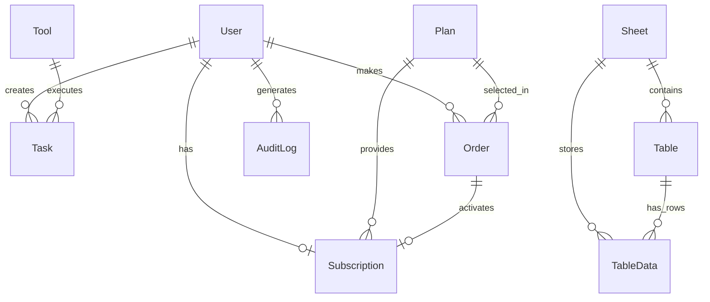
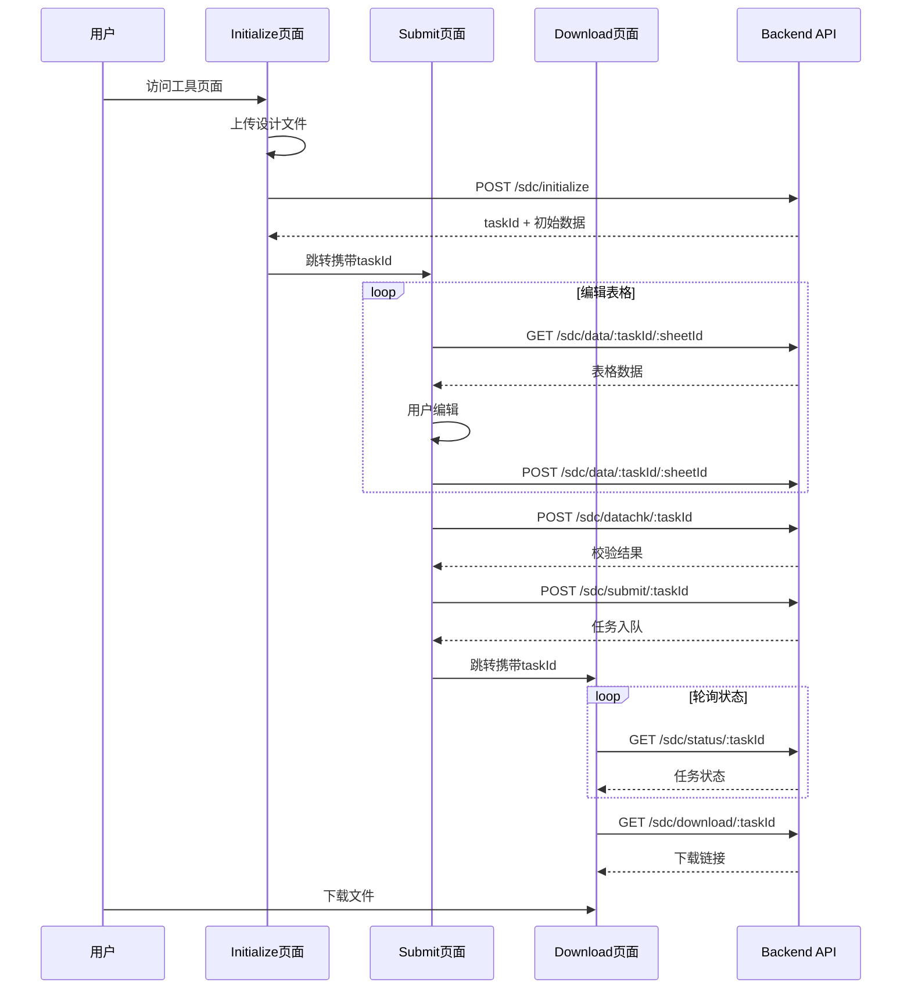
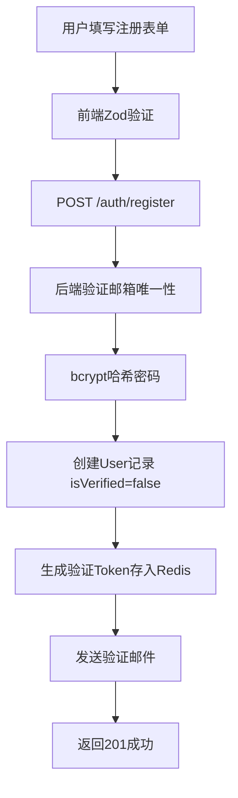
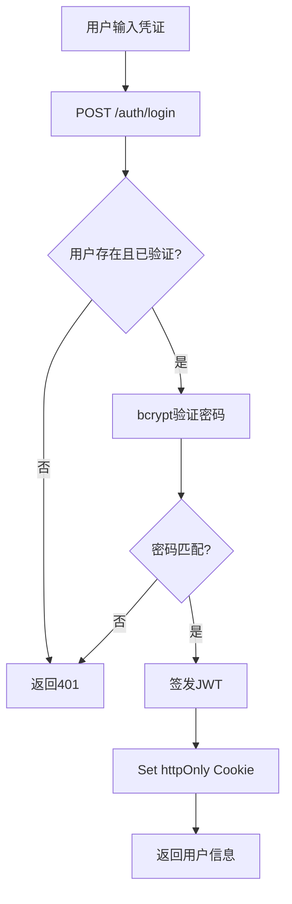

# LogicCore ECS Only多页面交互模式开发文档 (Part 1)

> 本文档续接Part 0，详细阐述数据库设计、API路由、前端页面架构和核心业务功能。

---

## 第5章：数据库设计

### 5.1 数据库模型概览

基于`prisma/schema.prisma`（283行），系统包含12个核心数据模型：



### 5.2 核心用户模型

#### User表

```prisma
model User {
  id                 String        @id @default(cuid())
  email              String        @unique
  password           String                          // bcrypt哈希
  name               String?
  avatar             String?
  isVerified         Boolean       @default(false)   // 邮箱验证状态
  role               Role          @default(USER)    // USER | ADMIN
  verificationToken  String?       @unique
  resetPasswordToken String?       @unique
  createdAt          DateTime      @default(now())
  updatedAt          DateTime      @updatedAt
  
  // 关系
  auditLogs          AuditLog[]
  orders             Order[]
  subscription       Subscription?  // 一对一
  tasks              Task[]
}
```

### 5.3 工具与任务模型

#### Tool表

```prisma
model Tool {
  id             String   @id @default(cuid())
  name           String   @unique              // SDC Generator, UPF Generator
  description    String
  inputSchema    Json                          // 输入参数Schema
  dockerImage    String                        // 镜像名称
  version        String
  configTemplate Json?
  isPublic       Boolean  @default(true)
  toolType       String   @default("sdcgen")   // sdcgen | upfgen
  createdAt      DateTime @default(now())
  updatedAt      DateTime @updatedAt
  tasks          Task[]
}
```

#### Task表（核心任务模型）

```prisma
model Task {
  id                    String         @id @default(cuid())
  userId                String
  toolId                String
  status                TaskStatus     @default(PENDING)
  parameters            Json           // 任务参数（含modName, isFlat等）
  inputFile             String?        // 输入文件路径
  outputFile            String?        // 输出文件路径
  logFile               String?        // 日志文件路径
  
  // ECS Only模式字段
  deploymentMode        String?        @default("ecs_only")
  localStoragePath      String?        // 本地存储路径
  ecsInstanceId         String?
  
  // 时间追踪
  createdAt             DateTime       @default(now())
  queuedAt              DateTime       @default(now())
  startedAt             DateTime?      // Worker开始处理时间
  containerStartedAt    DateTime?      // 容器启动时间（超时起点）
  finishedAt            DateTime?      // 完成时间
  
  // Worker信息
  workerId              String?
  
  // 错误处理
  errorMessage          String?
  failureReason         String?
  
  // 下载状态
  downloadStatus        DownloadStatus @default(NOT_DOWNLOADED)
  downloadedAt          DateTime?
  downloadTimeRemaining Int?           // 2分钟倒计时（秒）
  
  // 超时控制
  timeoutAt             DateTime?
  timeoutType           TimeoutType?   @default(NONE)
  
  // 重试机制
  retryCount            Int            @default(0)
  maxRetries            Int            @default(3)
  originalTaskId        String?        // 重试任务的原始ID
  
  // 进度追踪
  progress              Int            @default(0)   // 0-100
  currentStep           String?
  stepStartedAt         DateTime?
  cleanedAt             DateTime?      // 清理完成时间
  
  // 关系
  tool                  Tool           @relation(...)
  user                  User           @relation(...)
  
  // 索引优化
  @@index([userId, status])
  @@index([userId, createdAt])
  @@index([status, createdAt])
  @@index([deploymentMode, status])
  @@index([downloadStatus])
  @@index([queuedAt])
}
```

#### 任务状态枚举

```prisma
enum TaskStatus {
  DRAFT              // 多页面模式：用户填写中
  PENDING            // 等待执行
  RUNNING            // 执行中
  COMPLETED          // 完成
  FAILED             // 失败
  CANCELLED          // 取消
  QUEUE_TIMEOUT      // 队列超时
  EXECUTION_TIMEOUT  // 执行超时
}

enum DownloadStatus {
  NOT_DOWNLOADED     // 未下载
  AVAILABLE          // 可下载
  DOWNLOADED         // 已下载
  EXPIRED            // 已过期
}
```

### 5.4 多页面交互模型

#### Sheet表（工作表结构）

```prisma
model Sheet {
  id           String      @id @default(cuid())
  toolType     String      @map("tool_type")      // sdcgen | upfgen
  sheetName    String      @map("sheet_name")     // VarDef, ClkDef, IODly等
  displayOrder Int         @map("display_order")
  createdAt    DateTime    @default(now())
  updatedAt    DateTime    @updatedAt
  tables       Table[]
  TableData    TableData[]
  
  @@unique([toolType, sheetName])
  @@index([toolType])
  @@map("sheets")
}
```

#### Table表（表格结构定义）

```prisma
model Table {
  id            String      @id @default(cuid())
  sheetId       String      @map("sheet_id")
  toolType      String      @map("tool_type")
  tableName     String      @map("table_name")     // TMVAR, TMCLK等
  columnsSchema Json        @map("columns_schema") // 列定义
  displayOrder  Int         @map("display_order")
  taskId        String?     @map("task_id")        // 任务级隔离
  isTemplate    Boolean     @default(false)        // 是否基础模板
  createdAt     DateTime    @default(now())
  updatedAt     DateTime    @updatedAt
  
  sheet         Sheet       @relation(...)
  tableData     TableData[]
  
  @@unique([sheetId, tableName, taskId])
  @@index([toolType])
  @@index([taskId])
  @@map("tables")
}
```

#### TableData表（表格数据存储）

```prisma
model TableData {
  id               String   @id @default(cuid())
  userId           String   @map("user_id")        // 用户隔离
  taskId           String   @map("task_id")        // 任务隔离
  tableId          String   @map("table_id")
  sheetId          String   @map("sheet_id")
  rowNumber        Int      @map("row_number")
  rowData          Json     @map("row_data")       // 行数据
  dropdownData     Json?    @map("dropdown_data")  // 下拉选项
  validationData   Json?    @map("validation_data")// 验证规则
  createdAt        DateTime @default(now())
  updatedAt        DateTime @updatedAt
  
  table            Table    @relation(...)
  sheet            Sheet    @relation(...)
  
  @@unique([taskId, tableId, rowNumber])
  @@index([userId, taskId])
  @@index([taskId])
  @@map("table_data")
}
```

### 5.5 订阅与订单模型

#### Plan表

```prisma
model Plan {
  id            String         @id @default(cuid())
  name          String         @unique              // Free, Professional
  description   String?
  priceMonth    Decimal        @db.Decimal(10, 2)
  priceYear     Decimal        @db.Decimal(10, 2)
  features      Json           // 功能配置JSON
  createdAt     DateTime       @default(now())
  updatedAt     DateTime       @updatedAt
  orders        Order[]
  subscriptions Subscription[]
}
```

**features字段结构示例**：

```json
{
  "totalUsageLimit": 20,          // Free用户总次数限制
  "monthlyUsageLimit": 50,        // Pro用户月度限制
  "concurrentTasks": 2,           // 并发任务数
  "storageSpaceMB": 20,           // 存储空间
  "downloadTimeoutMinutes": 2,    // 下载超时
  "billingType": "total_usage"    // 计费类型
}
```

---

## 第6章：API路由系统

### 6.1 路由结构概览

后端API采用`/api/v1`前缀，共18个路由模块：

| 路由文件 | 路径前缀 | 功能描述 |
|---------|---------|---------|
| auth.routes.ts | /auth | 认证（注册/登录/验证） |
| user.routes.ts | /users | 用户信息管理 |
| task.routes.ts | /tasks | 任务基础操作 |
| sdc_thrpages.routes.ts | /sdc | SDC多页面交互 |
| upf_thrpages.routes.ts | /upf | UPF多页面交互 |
| plan.routes.ts | /plans | 会员计划 |
| order.routes.ts | /orders | 订单管理 |
| subscription.routes.ts | /subscriptions | 订阅管理 |
| payment.routes.ts | /payment | 支付回调 |
| download.routes.ts | /download | 文件下载 |
| admin.routes.ts | /admin | 后台管理 |

### 6.2 SDC多页面交互路由

`sdc_thrpages.routes.ts`（6743字节）：

```typescript
// Initialize阶段路由
POST   /sdc/initialize              // 初始化任务，解析上传文件
GET    /sdc/sheets/:taskId          // 获取Sheet列表
GET    /sdc/tables/:sheetId         // 获取Table结构

// Submit阶段路由
GET    /sdc/data/:taskId/:sheetId   // 获取表格数据
POST   /sdc/data/:taskId/:sheetId   // 保存表格数据
POST   /sdc/datachk/:taskId         // 数据校验
POST   /sdc/submit/:taskId          // 提交执行

// Download阶段路由
GET    /sdc/status/:taskId          // 获取任务状态
GET    /sdc/download/:taskId        // 下载结果文件
```

### 6.3 UPF多页面交互路由

`upf_thrpages.routes.ts`（6312字节）结构与SDC类似：

```typescript
POST   /upf/initialize
GET    /upf/sheets/:taskId
GET    /upf/tables/:sheetId
GET    /upf/data/:taskId/:sheetId
POST   /upf/data/:taskId/:sheetId
POST   /upf/datachk/:taskId
POST   /upf/submit/:taskId
GET    /upf/status/:taskId
GET    /upf/download/:taskId
```

### 6.4 认证路由

```typescript
POST   /auth/register               // 用户注册
POST   /auth/login                  // 用户登录
POST   /auth/logout                 // 用户登出
GET    /auth/verify-email           // 邮箱验证
POST   /auth/resend-verification    // 重发验证邮件
POST   /auth/request-password-reset // 请求密码重置
POST   /auth/reset-password         // 重置密码
```

### 6.5 任务路由

`task.routes.ts`（2636字节）：

```typescript
POST   /tasks                       // 创建任务
GET    /tasks                       // 获取用户任务列表
GET    /tasks/:taskId               // 获取任务详情
GET    /tasks/:taskId/status        // 获取任务状态
GET    /tasks/:taskId/download      // 下载任务结果
DELETE /tasks/:taskId               // 取消任务
```

### 6.6 管理后台路由

`admin.routes.ts`（2490字节）：

```typescript
// 仪表盘
GET    /admin/dashboard/stats       // 统计数据

// 用户管理
GET    /admin/users                 // 用户列表
POST   /admin/users                 // 创建用户
GET    /admin/users/:userId         // 用户详情
PUT    /admin/users/:userId         // 更新用户
DELETE /admin/users/:userId         // 删除用户

// 任务管理
GET    /admin/tasks                 // 任务列表
GET    /admin/tasks/:taskId         // 任务详情

// 订单、订阅、计划、工具管理...
```

---

## 第7章：前端页面架构

### 7.1 页面结构概览

前端采用React Router v6，共44个页面组件：

```
src/pages/
├── tools/           # 工具页面（15个）
│   ├── SDC多页面模式
│   │   ├── SdcGeneratorInitialize_thrpages.tsx  (26KB)
│   │   ├── SdcGeneratorSubmit_thrpages.tsx      (147KB) ⭐核心
│   │   └── SdcGeneratorDownload_thrpages.tsx    (5KB)
│   ├── UPF多页面模式
│   │   ├── UpfGeneratorInitialize_thrpages.tsx  (31KB)
│   │   ├── UpfGeneratorSubmit_thrpages.tsx      (148KB) ⭐核心
│   │   └── UpfGeneratorDownload_thrpages.tsx    (5KB)
│   ├── 单页面模式
│   │   ├── SdcGeneratorPage.tsx                 (35KB)
│   │   └── UPFGeneratorPage.tsx                 (32KB)
│   └── index.tsx    # 工具首页
├── admin/           # 管理后台（11个）
├── auth/            # 认证页面（6个）
├── order/           # 订单页面（4个）
└── ...
```

### 7.2 多页面交互流程



### 7.3 核心页面组件分析

#### SdcGeneratorSubmit_thrpages.tsx（147KB）

这是SDC工具的核心表格编辑页面，主要功能：

```typescript
// 核心状态管理
const [currentSheet, setCurrentSheet] = useState<string>('VarDef');
const [tableData, setTableData] = useState<Record<string, any[]>>({});
const [validationErrors, setValidationErrors] = useState<any[]>([]);

// Sheet切换组件
<Tabs value={currentSheet} onValueChange={setCurrentSheet}>
  <TabsList>
    {sheets.map(sheet => (
      <TabsTrigger key={sheet.id} value={sheet.sheetName}>
        {sheet.sheetName}
      </TabsTrigger>
    ))}
  </TabsList>
</Tabs>

// 表格编辑组件（类Excel交互）
<DataTable
  columns={tableColumns}
  data={tableData[currentSheet]}
  onCellChange={handleCellChange}
  onRowAdd={handleRowAdd}
  onRowDelete={handleRowDelete}
/>

// 数据校验和提交
const handleDataCheck = async () => {
  const result = await api.post(`/sdc/datachk/${taskId}`);
  setValidationErrors(result.errors);
};

const handleSubmit = async () => {
  await api.post(`/sdc/submit/${taskId}`);
  navigate(`/tools/sdc-generator/download?taskId=${taskId}`);
};
```

### 7.4 路由配置

`App.tsx`（327行）中的路由定义：

```tsx
<Routes>
  {/* 公开页面 */}
  <Route path="/" element={<HomePage />} />
  <Route path="/login" element={<LoginPage />} />
  <Route path="/register" element={<RegisterPage />} />
  
  {/* 工具页面（需登录） */}
  <Route path="/tools" element={<ProtectedRoute><ToolsIndex /></ProtectedRoute>} />
  
  {/* SDC多页面模式 */}
  <Route path="/tools/sdc-generator" element={
    <ProtectedRoute><SDCGeneratorThrpages /></ProtectedRoute>
  } />
  <Route path="/tools/sdc-generator/initialize" element={
    <ProtectedRoute><SDCGeneratorInitializeThrpages /></ProtectedRoute>
  } />
  <Route path="/tools/sdc-generator/submit" element={
    <ProtectedRoute><SDCGeneratorSubmitThrpages /></ProtectedRoute>
  } />
  <Route path="/tools/sdc-generator/download" element={
    <ProtectedRoute><SDCGeneratorDownloadThrpages /></ProtectedRoute>
  } />
  
  {/* UPF多页面模式（同上结构） */}
  
  {/* 管理后台（需Admin角色） */}
  <Route path="/admin/*" element={
    <AdminRoute><AdminLayout><Outlet /></AdminLayout></AdminRoute>
  }>
    <Route path="dashboard" element={<DashboardPage />} />
    <Route path="users" element={<UsersPage />} />
    <Route path="tasks" element={<TasksPage />} />
    ...
  </Route>
</Routes>
```

---

## 第8章：核心业务功能

### 8.1 用户认证系统

#### 注册流程



#### 登录流程



#### JWT认证中间件

```typescript
// middleware/auth.ts
export const authenticateToken = async (req, res, next) => {
  const token = req.cookies.access_token;
  if (!token) return res.status(401).json({ error: 'Unauthorized' });
  
  try {
    const decoded = jwt.verify(token, process.env.JWT_SECRET);
    const user = await prisma.user.findUnique({ where: { id: decoded.userId } });
    if (!user) return res.status(401).json({ error: 'User not found' });
    req.user = user;
    next();
  } catch (error) {
    return res.status(401).json({ error: 'Invalid token' });
  }
};

export const requireRole = (role: Role) => (req, res, next) => {
  if (req.user.role !== role) {
    return res.status(403).json({ error: 'Forbidden' });
  }
  next();
};
```

### 8.2 订阅服务系统

#### 订阅权限配置

基于实际代码`middleware/subscription.ts`，系统实现了以下用户类型和限制配置：

```typescript
// 用户类型和限制配置
const USER_LIMITS = {
  FREE: {
    maxConcurrentTasks: 3,    // 最多3个并发任务
    totalUsageLimit: 20,       // 总使用次数限制20次
    monthlyLimit: null,        // 免费用户无月度限制
  },
  PROFESSIONAL: {
    maxConcurrentTasks: 5,    // 最多5个并发任务
    totalUsageLimit: null,    // 专业用户无总次数限制
    monthlyLimit: 200,         // 月度使用次数限制200次
  }
};
```

#### 权限检查中间件实现

`middleware/subscription.ts`中的`checkTaskExecutionPermission`中间件实现了完整的权限检查逻辑：

```typescript
export const checkTaskExecutionPermission = async (req, res, next) => {
  // 1. 获取用户的活跃订阅信息
  const subscription = await prisma.subscription.findFirst({
    where: {
      userId: req.user.id,
      status: 'ACTIVE',
      endDate: { gt: new Date() }
    },
    include: { plan: true }
  });

  // 2. 确定用户类型（免费或专业）
  const userType = subscription ? 'PROFESSIONAL' : 'FREE';
  const limits = USER_LIMITS[userType];

  // 3. 检查并发任务数限制
  const runningTasks = await prisma.task.count({
    where: {
      userId: req.user.id,
      status: { in: ['PENDING', 'RUNNING'] }
    }
  });

  if (runningTasks >= limits.maxConcurrentTasks) {
    return res.status(403).json({
      message: `当前有${runningTasks}个任务正在执行，最多同时执行${limits.maxConcurrentTasks}个任务`,
      code: 'CONCURRENT_LIMIT_EXCEEDED'
    });
  }

  // 4. 检查免费用户总使用次数限制
  if (userType === 'FREE' && limits.totalUsageLimit) {
    const totalUsage = await prisma.task.count({
      where: { userId: req.user.id }
    });

    if (totalUsage >= limits.totalUsageLimit) {
      return res.status(403).json({
        message: `免费使用次数已达上限（${limits.totalUsageLimit}次）`,
        code: 'TOTAL_USAGE_LIMIT_EXCEEDED',
        redirectTo: '/membership'
      });
    }
  }

  // 5. 检查专业用户月度使用次数限制
  if (userType === 'PROFESSIONAL' && limits.monthlyLimit) {
    const now = new Date();
    const monthStart = new Date(now.getFullYear(), now.getMonth(), 1);

    const monthlyUsage = await prisma.task.count({
      where: {
        userId: req.user.id,
        createdAt: { gte: monthStart }
      }
    });

    if (monthlyUsage >= limits.monthlyLimit) {
      return res.status(403).json({
        message: `本月使用额度已消耗完毕（${limits.monthlyLimit}次）`,
        code: 'MONTHLY_LIMIT_EXCEEDED'
      });
    }
  }

  next();
};
```

#### 自动创建Free订阅

`services/auth.service.ts`中的`registerUser`函数在用户注册时自动创建Free订阅：

```typescript
export const registerUser = async (email: string, password: string) => {
  // 1. 创建用户记录
  const user = await prisma.user.create({
    data: { email, password: passwordHash }
  });

  // 2. 自动创建Free订阅（不需要订单）
  const freePlan = await prisma.plan.findFirst({
    where: { name: 'Free' }
  });

  if (freePlan) {
    // Free用户订阅永久有效（10年后过期）
    const endDate = new Date();
    endDate.setFullYear(endDate.getFullYear() + 10);

    await prisma.subscription.create({
      data: {
        userId: user.id,
        planId: freePlan.id,
        status: 'ACTIVE',
        startDate: new Date(),
        endDate: endDate
      }
    });
  }

  // 3. 生成6位数字验证码（存入Redis，2分钟有效期）
  const verificationCode = generateVerificationCode();
  await redisPool.getClient().set(
    `verification_code:${user.email}`,
    verificationCode,
    'EX',
    60 * 2
  );

  await sendVerificationCodeEmail(user.email, verificationCode);

  return user;
};
```

### 8.3 支付交易系统

#### 订单创建流程

`services/order.service.ts`中的`createOrderAndInitiatePayment`函数实现了完整的订单创建流程：

```typescript
export const createOrderAndInitiatePayment = async (
  userId: string,
  planId: string,
  billingCycle: 'MONTHLY' | 'YEARLY',
  paymentMethod: PaymentMethod
) => {
  // 1. 获取计划详情和价格
  const plan = await prisma.plan.findUnique({ where: { id: planId } });
  const amount = billingCycle === 'YEARLY'
    ? plan.priceYear
    : plan.priceMonth;

  // 2. 创建PENDING状态的订单
  const order = await prisma.order.create({
    data: {
      userId,
      planId,
      amount,
      status: 'PENDING',
      paymentMethod: paymentMethod
    }
  });

  // 3. 调用支付网关生成支付二维码
  let paymentDetails;
  if (paymentMethod === 'ALIPAY') {
    paymentDetails = await paymentService.createAlipayPayment(order);
  } else if (paymentMethod === 'WECHAT') {
    paymentDetails = await paymentService.createWechatPayPayment(order);
  }

  return { order, paymentDetails };
};
```

#### 支付宝支付实现

`services/payment.service.ts`中的支付宝支付集成：

```typescript
export const createAlipayPayment = async (order: Order) => {
  const result = await alipaySdk.exec('alipay.trade.precreate', {
    notifyUrl: ALIPAY_NOTIFY_URL,
    bizContent: {
      out_trade_no: order.id,
      total_amount: CurrencyCalculator.format(amountDecimal),
      subject: `Membership Subscription - ${order.planId}`,
      timeout_express: '10m'  // 二维码10分钟过期
    }
  });

  if (result.code === '10000') {
    return { qrCode: result.qrCode };
  } else {
    throw new Error(`Alipay error: ${result.subMsg || result.msg}`);
  }
};
```

#### 微信支付实现

```typescript
export const createWechatPayPayment = async (order: Order) => {
  const result = await wechatPayApi.transactions_native({
    description: `LogicCore Membership - ${order.planId}`,
    out_trade_no: order.id,
    notify_url: WECHAT_NOTIFY_URL,
    amount: {
      total: CurrencyCalculator.yuanToFen(amountDecimal)  // 微信支付使用分
    }
  });

  if (result.data.code_url) {
    return { qrCode: result.data.code_url };
  } else {
    throw new Error(`WeChat Pay error: ${result.data.message}`);
  }
};
```

#### 支付回调处理（幂等性保证）

`services/order.service.ts`中的`processAlipayNotification`函数使用增强的分布式锁确保幂等性：

```typescript
export const processAlipayNotification = async (params: any) => {
  const orderId = params.out_trade_no;
  const gatewayTransactionId = params.trade_no;

  // 使用增强的分布式锁确保幂等性
  const lockKey = `payment_callback_${orderId}_${gatewayTransactionId}`;
  const lockResult = await acquireEnhancedLock(lockKey, 300); // 5分钟锁定

  if (!lockResult.acquired) {
    logger.warn('Duplicate payment callback ignored due to lock');
    return;
  }

  try {
    await prisma.$transaction(async (tx) => {
      // 1. 查找订单
      const order = await tx.order.findUnique({ where: { id: orderId } });

      // 2. 幂等性检查
      if (order.status === 'PAID') {
        logger.info('Order already processed, skipping duplicate notification');
        return;
      }

      // 3. 更新订单状态
      await tx.order.update({
        where: { id: order.id },
        data: {
          status: 'PAID',
          paymentId: gatewayTransactionId
        }
      });

      // 4. 创建或更新用户订阅
      const currentSubscription = await tx.subscription.findUnique({
        where: { userId: order.userId }
      });

      const billingCycle = /* 根据订单金额判断 */ 'MONTHLY' | 'YEARLY';
      const monthsToAdd = billingCycle === 'YEARLY' ? 12 : 1;

      if (currentSubscription && currentSubscription.status === 'ACTIVE') {
        // 续订：延长现有订阅
        const newEndDate = new Date(currentSubscription.endDate);
        newEndDate.setMonth(newEndDate.getMonth() + monthsToAdd);

        await tx.subscription.update({
          where: { id: currentSubscription.id },
          data: { endDate: newEndDate }
        });
      } else {
        // 激活：创建新订阅或重新激活
        const startDate = new Date();
        const endDate = new Date(startDate);
        endDate.setMonth(endDate.getMonth() + monthsToAdd);

        await tx.subscription.upsert({
          where: { userId: order.userId },
          update: {
            planId: order.planId,
            status: 'ACTIVE',
            startDate: startDate,
            endDate: endDate
          },
          create: {
            userId: order.userId,
            planId: order.planId,
            status: 'ACTIVE',
            startDate: startDate,
            endDate: endDate
          }
        });
      }
    });

    logger.info('Alipay payment notification processed successfully');

  } finally {
    // 释放分布式锁
    if (lockResult.release) {
      await lockResult.release();
    }
  }
};
```

### 8.4 工具任务执行系统

#### 任务创建完整流程

`services/task.service.ts`中的`createTask`函数实现了完整的任务创建流程：

```typescript
export const createTask = async (
  body: any,
  userId: string,
  inputFiles?: Express.Multer.File[]
): Promise<Task> => {
  // 步骤1：生成唯一TaskID
  const taskId = await TaskIdGeneratorService.generateUniqueTaskId();

  // 步骤2：初始化任务日志器
  const taskLogger = await createTaskLogger(taskId, userId, username, toolId);
  await taskLogger.logStepStart('TASK_SUBMISSION', 'User submitted task');

  // 步骤3：权限验证
  const subscription = await prisma.subscription.findFirst({
    where: {
      userId: userId,
      status: 'ACTIVE',
      endDate: { gt: new Date() }
    },
    include: { plan: true }
  });
  const userPermissionType = subscription ? 'pro' : 'free';

  // 步骤4：检查Redis队列上限
  const maxQueueLength = parseInt(process.env.MAX_QUEUE_LENGTH || '48');
  const currentQueueLength = await redisPool.getClient().llen('task_queue');

  if (currentQueueLength >= maxQueueLength) {
    throw new Error(`队列已满，当前队列长度: ${currentQueueLength}/${maxQueueLength}`);
  }

  // 步骤5：创建数据库任务记录
  const task = await prisma.task.create({
    data: {
      id: taskId,
      userId: userId,
      toolId: context.actualToolId,
      status: 'PENDING',
      deploymentMode: context.deploymentMode,
      queuedAt: new Date(),
      parameters: taskParameters,
      retryCount: 0,
      maxRetries: 3
    }
  });

  // 步骤6：创建temp/{taskId}目录
  const tempDir = path.join(tempUploadDir, taskId);
  await FileSystemLockService.safeCreateDirectory(tempDir);

  // 步骤7：保存上传文件到temp目录
  if (inputFiles && inputFiles.length > 0) {
    for (const file of inputFiles) {
      const filePath = path.join(tempDir, file.originalname);
      await fs.writeFile(filePath, file.buffer);
    }
  }

  // 步骤8：任务入队（原子性操作）
  const enqueueSuccess = await redisPool.atomicEnqueueIfNotFull(
    'task_queue',
    task.id,
    maxQueueLength
  );

  if (!enqueueSuccess) {
    // 清理已创建的资源
    await FileSystemLockService.safeRemoveDirectory(tempDir);
    await prisma.task.delete({ where: { id: task.id } });
    throw new Error('任务入队失败，请稍后再试');
  }

  // 步骤9：发送WebSocket通知
  const webSocketService = getWebSocketService();
  if (webSocketService) {
    webSocketService.notifyTaskStatusUpdate(
      userId,
      taskId,
      'PENDING',
      {
        progress: 0,
        currentStep: 'QUEUED',
        queuePosition: currentQueueLength + 1
      }
    );
  }

  return task;
};
```

#### Worker任务执行流程

`workers/toolWorker.py`中的`process_task_ecs_only`函数实现了ECS Only模式下的任务执行：

```python
def process_task_ecs_only(task_id, task_logger):
    """ECS Only模式任务处理流程"""

    # 步骤a8: Worker获取任务ID
    await task_logger.log_step_start('WORKER_ASSIGNED', 'Worker获取任务ID')

    # 步骤a9: 加载Docker镜像
    await task_logger.log_step_start('CONTAINER_IMAGE_LOADING', '工具容器加载')
    docker_image = load_image_from_tar(image_tar_path)

    # 步骤a10: 创建jobs目录并复制数据
    await task_logger.log_step_start('JOBS_DIRECTORY_CREATION', '创建jobs目录')

    # 创建jobs/{taskId}/input, output, logs, work目录
    host_paths = {
        'input': os.path.join(base_jobs_dir, task_id, 'input'),
        'output': os.path.join(base_jobs_dir, task_id, 'output'),
        'logs': os.path.join(base_jobs_dir, task_id, 'logs'),
        'work': os.path.join(base_jobs_dir, task_id, 'work')
    }

    for path in host_paths.values():
        os.makedirs(path, exist_ok=True)

    # 复制temp/{taskId}到jobs/{taskId}/input
    await task_logger.log_step_start('TEMP_TO_JOBS_COPY', '复制数据文件')
    for filename in os.listdir(temp_dir):
        src = os.path.join(temp_dir, filename)
        dst = os.path.join(host_paths['input'], filename)
        shutil.copy2(src, dst)

    # 步骤a11: 启动Docker容器执行
    await task_logger.log_step_start('CONTAINER_EXECUTION', '容器启动执行')

    # 准备容器挂载卷配置
    volumes = prepare_container_volumes(task_id, base_jobs_dir)

    # 启动容器
    container = docker_client.containers.run(
        docker_image,
        name=f"task_{task_id}",
        volumes=volumes,
        environment={
            'TASK_ID': task_id,
            'TOOL_TYPE': tool_type,
            'MOD_NAME': mod_name,
            'IS_FLAT': is_flat,
            # 其他环境变量...
        },
        detach=True,
        remove=True
    )

    # 等待容器执行完成
    result = container.wait()
    logs = container.logs()

    # 步骤a12: 生成结果并打包
    await task_logger.log_step_start('RESULT_PACKAGING', '生成结果并打包')

    # 收集输出文件
    output_files = []
    for root, dirs, files in os.walk(host_paths['output']):
        for file in files:
            file_path = os.path.join(root, file)
            output_files.append(file_path)

    # 打包结果文件
    result_zip = os.path.join(host_paths['output'], f"{task_id}_{tool_type}_result.zip")
    with zipfile.ZipFile(result_zip, 'w') as zipf:
        for file in output_files:
            arcname = os.path.relpath(file, host_paths['output'])
            zipf.write(file, arcname)

    # 步骤a13: 清理jobs/{taskId}/work目录
    await task_logger.log_step_start('WORK_DIRECTORY_CLEANUP', '清理work目录')
    shutil.rmtree(host_paths['work'], ignore_errors=True)

    # 步骤a14: 更新任务状态并计划清理temp目录
    await task_logger.log_step_start('TEMP_CLEANUP_SCHEDULE', '计划清理temp目录')

    # 更新数据库任务状态为COMPLETED
    update_task_status_via_api(task_id, 'COMPLETED', {
        'outputFile': os.path.basename(result_zip),
        'finishedAt': datetime.now(timezone.utc).isoformat()
    })

    # 安排2分钟后清理temp/{taskId}目录
    schedule_temp_cleanup(task_id, delay_seconds=120)

    await task_logger.log_step_success('COMPLETED', '任务完成')
```

#### 任务状态更新与WebSocket通知

`services/task.service.ts`中的`updateTaskStatusInternal`函数确保前端状态同步：

```typescript
export const updateTaskStatusInternal = async (
  taskId: string,
  updateData: {
    status?: string;
    progress?: number;
    currentStep?: string;
    finishedAt?: Date;
    outputFile?: string;
    downloadTimeRemaining?: number;
  }
) => {
  // 1. 更新数据库任务状态
  const task = await prisma.task.update({
    where: { id: taskId },
    data: { ...updateData, updatedAt: new Date() }
  });

  // 2. 发送WebSocket通知给前端
  const webSocketService = getWebSocketService();
  if (webSocketService) {
    // 计算下载剩余时间
    let calculatedDownloadTimeRemaining = updateData.downloadTimeRemaining;
    if (task.status === 'COMPLETED' && task.finishedAt) {
      const downloadTimeout = DeploymentModeService.getDownloadTimeout();
      const finishedTime = new Date(task.finishedAt).getTime();
      const now = Date.now();
      const elapsed = now - finishedTime;
      calculatedDownloadTimeRemaining = Math.max(0,
        Math.floor((downloadTimeout * 1000 - elapsed) / 1000)
      );
    }

    // 计算任务持续时间
    const calculateDuration = (createdAt: Date, finishedAt: Date | null): number => {
      if (!finishedAt) return 0;
      return Math.max(0, Math.round(
        (new Date(finishedAt).getTime() - new Date(createdAt).getTime()) / 1000
      ));
    };

    webSocketService.notifyTaskStatusUpdate(
      task.userId,
      taskId,
      task.status,
      {
        updatedAt: task.updatedAt.toISOString(),
        hasOutput: !!task.outputFile,
        progress: updateData.progress,
        currentStep: updateData.currentStep,
        downloadTimeRemaining: calculatedDownloadTimeRemaining,
        // 只有任务完成时才发送持续时间
        ...(task.status === 'COMPLETED' && task.finishedAt
          ? { duration: calculateDuration(task.createdAt, task.finishedAt) }
          : {})
      }
    );
  }

  return task;
};
```

### 8.5 日志管理监控系统

#### 请求监控中间件

`services/monitoring.service.ts`中的`MonitoringService`类实现了完整的请求监控：

```typescript
export class MonitoringService {
  private metrics: Map<string, any> = new Map();
  private alertThresholds = {
    responseTime: 5000,      // 5秒
    errorRate: 0.05,         // 5%
    memoryUsage: 0.9,        // 90%
    queueLength: 100         // 队列长度
  };

  // HTTP请求监控中间件
  public requestMonitoringMiddleware = (req, res, next) => {
    const startTime = Date.now();
    const requestId = Math.random().toString(36).substring(2, 15);

    // 增加请求计数
    this.incrementMetric('requests_total');
    this.incrementMetric('active_connections');

    // 监听响应完成
    res.on('finish', () => {
      const duration = Date.now() - startTime;
      this.decrementMetric('active_connections');

      // 记录响应时间
      this.recordResponseTime(duration);

      // 记录错误
      if (res.statusCode >= 400) {
        this.incrementMetric('requests_errors');
      }

      // 记录慢请求（超过5秒）
      if (duration > this.alertThresholds.responseTime) {
        logger.warn({
          requestId,
          method: req.method,
          url: req.url,
          duration,
          statusCode: res.statusCode
        }, 'Slow request detected');

        this.triggerAlert('slow_request', {
          method: req.method,
          url: req.url,
          duration
        });
      }
    });

    next();
  };
}
```

#### 健康检查系统

```typescript
public async getHealthStatus(): Promise<{
  status: 'healthy' | 'degraded' | 'unhealthy';
  checks: Record<string, any>;
  metrics: Record<string, any>;
}> {
  const checks: Record<string, any> = {};
  let overallStatus = 'healthy';

  // 1. 数据库健康检查
  const dbStart = Date.now();
  await prisma.$queryRaw`SELECT 1`;
  const dbDuration = Date.now() - dbStart;

  checks.database = {
    status: dbDuration < 1000 ? 'healthy' : 'degraded',
    responseTime: dbDuration
  };

  if (dbDuration >= 1000) overallStatus = 'degraded';
  if (dbDuration >= 5000) overallStatus = 'unhealthy';

  // 2. Redis健康检查
  const redisStart = Date.now();
  await this.redis.ping();
  const redisDuration = Date.now() - redisStart;

  checks.redis = {
    status: redisDuration < 500 ? 'healthy' : 'degraded',
    responseTime: redisDuration
  };

  // 3. 系统资源检查
  const memoryUsage = process.memoryUsage();
  const memoryUsagePercent = memoryUsage.heapUsed / memoryUsage.heapTotal;

  checks.memory = {
    status: memoryUsagePercent < 0.8 ? 'healthy' : 'degraded',
    usagePercent: Math.round(memoryUsagePercent * 100)
  };

  // 4. 队列长度检查
  const queueLength = await this.redis.llen('task_queue');
  checks.taskQueue = {
    status: queueLength < 50 ? 'healthy' : 'degraded',
    length: queueLength
  };

  // 5. 错误率检查
  const totalRequests = this.metrics.get('requests_total') || 0;
  const totalErrors = this.metrics.get('requests_errors') || 0;
  const errorRate = totalRequests > 0 ? totalErrors / totalRequests : 0;

  checks.errorRate = {
    status: errorRate < 0.01 ? 'healthy' : 'degraded',
    rate: Math.round(errorRate * 100 * 100) / 100
  };

  return {
    status: overallStatus,
    checks,
    metrics: {
      totalRequests,
      totalErrors,
      errorRate: Math.round(errorRate * 100 * 100) / 100,
      avgResponseTime: /* 计算平均响应时间 */,
      memoryUsage,
      uptime: process.uptime()
    }
  };
}
```

#### 任务日志系统

`services/task-logger.service.ts`中的`TaskLogger`类实现了完整的任务日志记录：

```typescript
export class TaskLogger {
  private logsDir: string;
  private taskLogDir: string;
  private logFilePath: string;
  private stepStartTimes: Map<string, number> = new Map();

  constructor(taskId: string, userId: string, username: string, toolType: string) {
    // 使用专用的任务日志目录
    this.logsDir = process.env.TASK_LOGS_DIR || path.join(process.cwd(), 'logs');
    this.taskLogDir = path.join(this.logsDir, taskId);

    const submissionTime = new Date().toISOString().replace(/[:.]/g, '-');
    const logFileName = `${username}_${toolType}_${submissionTime}.log`;
    this.logFilePath = path.join(this.taskLogDir, logFileName);
  }

  // 记录步骤开始
  async logStepStart(step: string, message: string, details?: any): Promise<void> {
    const startTime = Date.now();
    this.stepStartTimes.set(step, startTime);

    await this.writeLog({
      timestamp: new Date().toISOString(),
      step,
      status: 'START',
      message,
      details
    });
  }

  // 记录步骤成功
  async logStepSuccess(step: string, message: string, details?: any): Promise<void> {
    const duration = this.calculateDuration(step);

    await this.writeLog({
      timestamp: new Date().toISOString(),
      step,
      status: 'SUCCESS',
      message,
      details,
      duration
    });
  }

  // 记录步骤错误
  async logStepError(step: string, message: string, error: any): Promise<void> {
    const duration = this.calculateDuration(step);

    await this.writeLog({
      timestamp: new Date().toISOString(),
      step,
      status: 'ERROR',
      message,
      details: {
        error: error.message || error,
        stack: error.stack
      },
      duration
    });
  }

  // 写入日志条目
  private async writeLog(entry: TaskLogEntry): Promise<void> {
    const logLine = JSON.stringify(entry) + '\n';
    await fs.appendFile(this.logFilePath, logLine, 'utf8');
  }

  // 清理旧日志（保留指定天数）
  static async cleanupOldLogs(retentionDays: number = 30): Promise<void> {
    const logsDir = path.join(process.cwd(), '../../logs');
    const cutoffTime = Date.now() - (retentionDays * 24 * 60 * 60 * 1000);

    const entries = await fs.readdir(logsDir, { withFileTypes: true });

    for (const entry of entries) {
      if (entry.isDirectory()) {
        const dirPath = path.join(logsDir, entry.name);
        const stats = await fs.stat(dirPath);

        if (stats.mtime.getTime() < cutoffTime) {
          await fs.rm(dirPath, { recursive: true, force: true });
        }
      }
    }
  }
}
```

### 8.6 后台管理系统

#### 仪表盘统计

`services/admin.service.ts`中的`getDashboardStatistics`函数提供完整的管理仪表盘数据：

```typescript
export const getDashboardStatistics = async () => {
  const [
    totalUsers,
    verifiedUsers,
    adminUsers,
    newUsersThisMonth,
    totalTasks,
    totalOrders,
    totalRevenue,
    activeSubscriptions,
    canceledSubscriptions,
    expiredSubscriptions,
    totalTools,
    publicTools,
    thisMonthOrders,
    thisMonthRevenue,
  ] = await Promise.all([
    // 用户统计
    prisma.user.count(),
    prisma.user.count({ where: { isVerified: true } }),
    prisma.user.count({ where: { role: Role.ADMIN } }),
    prisma.user.count({
      where: {
        createdAt: {
          gte: new Date(new Date().getFullYear(), new Date().getMonth(), 1)
        }
      }
    }),

    // 任务统计
    prisma.task.count(),

    // 订单统计
    prisma.order.count(),
    prisma.order.aggregate({
      where: { status: OrderStatus.PAID },
      _sum: { amount: true }
    }),

    // 订阅统计
    prisma.subscription.count({ where: { status: SubscriptionStatus.ACTIVE } }),
    prisma.subscription.count({ where: { status: SubscriptionStatus.CANCELED } }),
    prisma.subscription.count({ where: { status: SubscriptionStatus.EXPIRED } }),

    // 工具统计
    prisma.tool.count(),
    prisma.tool.count({ where: { isPublic: true } }),

    // 本月统计
    prisma.order.count({
      where: {
        createdAt: {
          gte: new Date(new Date().getFullYear(), new Date().getMonth(), 1)
        }
      }
    }),
    prisma.order.aggregate({
      where: {
        status: OrderStatus.PAID,
        createdAt: {
          gte: new Date(new Date().getFullYear(), new Date().getMonth(), 1)
        }
      },
      _sum: { amount: true }
    })
  ]);

  // 任务状态分布
  const tasksByStatus = await prisma.task.groupBy({
    by: ['status'],
    _count: { status: true }
  });

  const taskStatusCounts = tasksByStatus.reduce((acc, item) => {
    acc[item.status] = item._count.status;
    return acc;
  }, {} as Record<string, number>);

  return {
    users: {
      total: totalUsers,
      verified: verifiedUsers,
      admins: adminUsers,
      newThisMonth: newUsersThisMonth
    },
    tasks: {
      total: totalTasks,
      pending: taskStatusCounts[TaskStatus.PENDING] || 0,
      running: taskStatusCounts[TaskStatus.RUNNING] || 0,
      completed: taskStatusCounts[TaskStatus.COMPLETED] || 0,
      failed: taskStatusCounts[TaskStatus.FAILED] || 0
    },
    orders: {
      total: totalOrders,
      totalRevenue: totalRevenue._sum.amount || 0,
      thisMonth: thisMonthOrders,
      thisMonthRevenue: thisMonthRevenue._sum.amount || 0
    },
    subscriptions: {
      active: activeSubscriptions,
      canceled: canceledSubscriptions,
      expired: expiredSubscriptions
    },
    tools: {
      total: totalTools,
      public: publicTools
    }
  };
};
```

#### 用户管理

```typescript
export const getUsers = async (params: PaginationParams) => {
  const { page = 1, limit = 10, search, role } = params;
  const skip = (page - 1) * limit;

  const where: any = {};

  if (search) {
    where.OR = [
      { email: { contains: search, mode: 'insensitive' } },
      { name: { contains: search, mode: 'insensitive' } }
    ];
  }

  if (role) {
    where.role = role;
  }

  const [users, total] = await Promise.all([
    prisma.user.findMany({
      where,
      skip,
      take: limit,
      orderBy: { createdAt: 'desc' },
      select: {
        id: true,
        email: true,
        name: true,
        avatar: true,
        role: true,
        isVerified: true,
        createdAt: true,
        _count: {
          select: { tasks: true, orders: true }
        }
      }
    }),
    prisma.user.count({ where })
  ]);

  return {
    users,
    pagination: {
      total,
      page,
      limit,
      pages: Math.ceil(total / limit)
    }
  };
};

export const createUser = async (
  data: {
    email: string;
    password: string;
    name?: string;
    role: Role;
  },
  adminId: string
) => {
  // 检查用户是否已存在
  const existingUser = await prisma.user.findUnique({
    where: { email: data.email }
  });

  if (existingUser) {
    throw new Error('User with this email already exists');
  }

  // 哈希密码
  const hashedPassword = await bcrypt.hash(data.password, 12);

  // 创建用户（管理员创建的用户自动验证）
  const user = await prisma.user.create({
    data: {
      ...data,
      password: hashedPassword,
      isVerified: true
    }
  });

  // 创建审计日志
  await createAuditLog(adminId, 'createUser', user.id, {
    email: data.email,
    role: data.role
  });

  return user;
};
```

#### 任务管理

```typescript
export const getTasks = async (params: PaginationParams & {
  status?: string;
  toolId?: string;
  deploymentMode?: string;
}) => {
  const { page = 1, limit = 10, search, status, toolId, deploymentMode } = params;
  const skip = (page - 1) * limit;

  const where: any = {};

  if (search) {
    where.OR = [
      { id: { contains: search, mode: 'insensitive' } },
      { user: { email: { contains: search, mode: 'insensitive' } } }
    ];
  }

  if (status && status !== 'all') {
    where.status = status;
  }

  if (toolId && toolId !== 'all') {
    where.toolId = toolId;
  }

  if (deploymentMode && deploymentMode !== 'all') {
    where.deploymentMode = deploymentMode;
  }

  const [tasks, total] = await Promise.all([
    prisma.task.findMany({
      where,
      skip,
      take: limit,
      orderBy: { createdAt: 'desc' },
      include: {
        user: { select: { id: true, email: true, name: true } },
        tool: { select: { id: true, name: true, description: true } }
      }
    }),
    prisma.task.count({ where })
  ]);

  return {
    tasks,
    pagination: {
      total,
      page,
      limit,
      pages: Math.ceil(total / limit)
    }
  };
};
```

#### 审计日志

```typescript
const createAuditLog = async (
  actorId: string,
  action: string,
  targetId: string,
  details?: Record<string, any>
) => {
  await prisma.auditLog.create({
    data: {
      actorId,
      action,
      targetId,
      details: details || {}
    }
  });
};
```

#### 系统资源监控

```typescript
export const getSystemResources = async () => {
  // 获取系统资源信息
  const totalMemory = os.totalmem();
  const freeMemory = os.freemem();
  const usedMemory = totalMemory - freeMemory;
  const memoryUsagePercent = (usedMemory / totalMemory) * 100;

  // 获取CPU信息
  const cpus = os.cpus();
  const loadAverage = os.loadavg();

  // 获取磁盘使用情况
  const stats = await fs.statfs(process.cwd());
  const total = stats.blocks * stats.frsize;
  const free = stats.bavail * stats.frsize;
  const used = total - free;

  // 获取目录大小
  const jobsSize = await FileSystemLockService.getDirectorySize(
    path.join(process.cwd(), 'jobs')
  );
  const tempSize = await FileSystemLockService.getDirectorySize(
    path.join(process.cwd(), 'temp')
  );

  return {
    memory: {
      total: totalMemory,
      used: usedMemory,
      free: freeMemory,
      usagePercent: Math.round(memoryUsagePercent * 100) / 100
    },
    cpu: {
      count: cpus.length,
      model: cpus[0]?.model || 'Unknown',
      loadAverage: loadAverage.map(load => Math.round(load * 100) / 100)
    },
    disk: {
      total,
      used,
      free,
      usagePercent: Math.round((used / total) * 100 * 100) / 100
    },
    directories: {
      jobsSize,
      tempSize,
      totalSize: jobsSize + tempSize
    },
    uptime: os.uptime()
  };
};
```

---

下一部分：[Part 2 - 第9章：工具执行流程详解](ecsonly_multipage_dev_opus45_2.md)