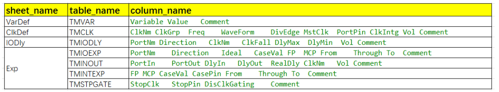
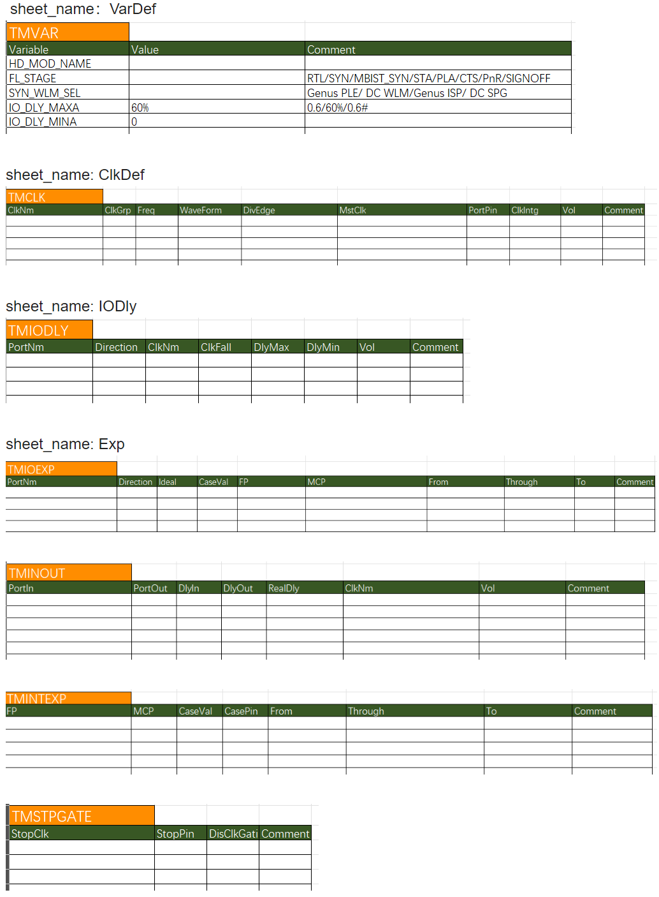
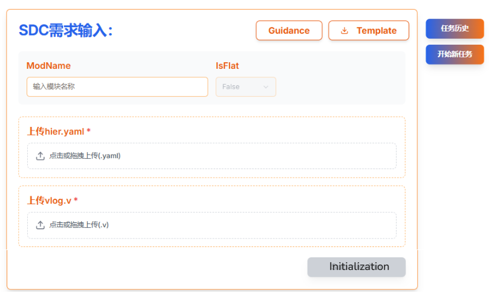
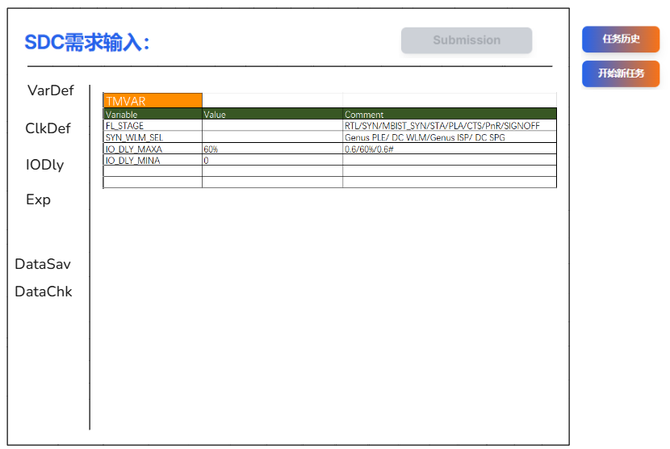
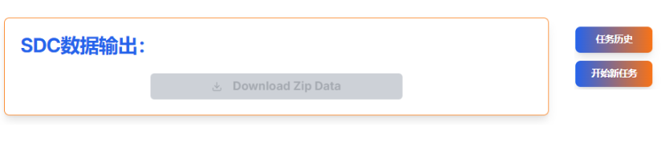

目前我们已经开发并测试了单页面工具交互方式，现在为了进一步提高用户体验，我们要开发多页面工具交互方式，让用户可以直接在网页端填写工具输入需求，实时更新并检查数据，接下来先开发SDC工具多页面交互功能，

### 项目背景和目前开发状态：
- 目前项目是针对ECS only部署方式的在线工具实时服务的项目，其中SDC工具和UPF工具是完全符合生产应用要求并已经正确通过本地Windows下的工具执行的完整测试；
- 针对目前开发好的前后端系统，前端页面、后端逻辑、API路由系统、数据库模型、Redis连接池、worker架构、容器执行、结果处理下载、清理系统、状态管理实时更新等方面都已经可以正确工作，所有目前所有工具相关的前后端相关代码逻辑都必须保留，确保功能正常工作；
- 目前工具是采用单页面交互方式，用户只需上传输入文件并提交任务开始，系统能够按照下面工具执行流程正确工作，详见如下流程，
	a1. ✅ 提交任务
	a2. ✅ **权限验证**  
	a3. ✅ **检查Redis队列上限**  
	a4. ✅ **建立任务ID数据库数据**  
	a5. ✅ **建立temp/{taskId}目录**  
	a6. ✅ **保存上传数据到temp/{taskId}目录**  
	a7. ✅ **任务入队**  
	a8. ✅ **Worker获取任务ID**  
	a9. ✅ **工具容器加载**  
	a10. ✅ **创建jobs/{taskId}目录，复制数据到jobs/{taskId}/input和jobs/{taskId}/work/{modName}/sdcgen/inputs**  
	a11. ✅ **容器启动执行工具命令**  
	a12. ✅ **生成结果并打包到jobs/{taskId}/output**  
	a13. ✅ **立即清理jobs/{taskId}/work目录**  
	a14. ✅ **2分钟下载期后清理temp/{taskId}目录和jobs/{taskId}**

### 新增功能介绍
- 目前工具页面都是采用单页面方式来交互，工具需求都是采用文件上传方式来实现，但是这样会导致用户体验不好，尤其是表格里的需求都是用户手动输入，所以现在想把需求填写方式尽可能网页化；

- 现在要求把dcont.xlsx里的不同sheet里的所有表格都进行网页化，让用户直接通过网页的形式来统一填写表格需求，并实时检查数据正确性，最后提交任务来完成工具任务的执行；

 - SDC工具的模板文件是templates/sdcgen/dcont_org.xlsx，该模板分四个sheet，名称分别是VarDef，ClkDef，IODly和Exp，每个sheet里有一张或者多张表格，每张表格都有相应的名称，比如ClkDef sheet里有表格名称TMCLK，这四个sheet名称和每个sheet里的所有表格名称都会作为网页端的名称和数据库模型设计依据，确保excel表格、数据库和网页端表格这三者表格一致并且数据相同，而数据库是excel表格和网页端表格的唯一中心同步数据源，更新excel表格数据或者网页端表格数据必须唯一来自数据库的相应表格数据，请记住这个要求，
 sheet名称、table名称和column名称对应关系如下，其中column名称就是每个表格的列头名称，

下面是数据流交互逻辑，
![[Pasted image 20250909112901.png]]

- SDC模板文件里的表格如下，其中Exp sheet里包含4张表格，前端提交页面里显示必须follow下面的显示格式，表头必须标注table_name，请解析并识别下表格截图内容，

### 代码逻辑实现：
- 首先必须仔细系统性的审查目前开发好的SDC工具相关的前后端代码文件和目录文件组织结构，清楚理解所有代码的功能逻辑细节；
- 由于目前版本的SDC工具已经开发完成并通过完整的工具执行流程测试，所以目前关于这个工具的前后端代码，数据库设计，API路由、Redis、worker架构系统、工具执行流程等等相关代码的组织结构和功能逻辑都必须保留不能修改，已有文件只能是复用不能修改（确保目前原有工具执行的正确性），请记住这一条编码规则;
- 如果发现目前原有相关代码文件只有部分代码符合要求，那么请新增另外一个代码文件，并要求所有新增的代码文件名必须在后缀前包含_thrpages字符，也就是完整文件名格式为*_thrpages.*，也同样请记住这一条编码规则；

- 我已经在app/backend/.env和app/backend/.env.local两个文件里增加了变量TOOL_PAGE_METHOD，这个变量是用来控制工具交互是采用单页还是多页方式，值分别是single和multi，默认值为multi，单页交互方式已经开发完并测试完，现在我们就是要实现多页交互（multi）方式；

- 根据SDC模板文件里的每个sheet里的表格来设计数据库模型，
	- 模板解析: 使用 `exceljs` 库，它不仅能读取单元格数据，还能完美地识别 Sheet 名称、Table 名称、Table 的列头，由此来设计元数据表来管理整个excel表格的数据，
	数据库表参考如下：
	- `sheets` 表: `tool_type`, `sheet_id (PK)`, `sheet_name (UNIQUE)`, ..., `last_modified`
	- `tables` 表: `tool_type`, `table_id (PK)`, `sheet_id (FK)`, `table_name (UNIQUE within a sheet)`,  ..., `last_modified`
	- `table_data` 表: `user_id`，`tool_type`, `task_id`, `data_id (PK)`, `table_id (FK)`, `sheet_id (FK)`, `row_number`，`row_data (JSONB)`, `row_index`，`column_name` ， `data_type`，`last_modified`，...
	    - `row_data` 字段可以直接存储一整行的数据，格式为 JSON 对象，例如：`{"列1": "值A", "列2": 123}`。使用 JSONB 类型（在 PostgreSQL 中）可以提高查询效率；
        - `row_number`字段是行号，必须是实际表格数据的行号，必须是数字，不能为负数，务必遵循；

	你可以根据模板文件里表格和实际工具使用场景要求来进一步优化数据库模型设计，
	`sheets` 表和`tables` 表跟工具类型和模板文件密切相关，
	必须注意`table_data` 表是跟user_id和task_id密切相关的，表里数据来自网页端用户输入，等完成任务后，或者任务没有执行提交就刷新或退出了，都必须删除该任务的数据库数据；
	所有excel相关的数据库数据的写入和读取都需要用户的权限和任务id等方面的授权和认证，确保能安全正确的操作对应用户对应工具对应任务的数据；

    数据库大概有几个操作，
    - 解析模板excel文件templates/sdcgen/dcont_org.xlsx，用来设计数据库并初始化数据库表格；
    - 在初始化页面点击initialization按钮后，同样会解析获取temp/<taskid>/dcont.xslx文件的表格数据，这里会有很多隐藏的下拉数据，同步更新数据库表格；
    - 在提交页面，点击sheet按钮，渲染表格，用户修改表格数据，点击DataSav按钮，会把网页端的所有表格数据同步更新到数据库；
    - 在提交页面，点击DataChk按钮，会将数据库数据同步到temp/<taskid>/dcont.xslx和json格式文件（vardef.json, clkdef.json, iodly.json, exp.json四个文件），都在temp/<taskid>/目录下；
    - 然后在提交页面根据用户是否有表格数据更新，来反复操作DataSav保存和DataChk检查，反复对数据库进行操作；
	- Excel ↔ 数据库，以及数据库 ↔ 网页端，这两种双方交互方式，必须是要在双方数据交互后，验证交互的双方各自表格数据是否一致的正确的相同的数据，必须包括对应表格结构验证检查，表格单元格数据值检查，还有单元格下拉数据的验证检查，务必理解这些关键点检查要求；

- SDC模板里的表格对应的数据库模型转化为网页形式表格，设计API路由来渲染到对应页面，表格可以自动让用户添加行，列不能添加，只要鼠标悬浮出现+符号点击就可以增加新行，每个表格每页最多显示50行数据，超过50行分页显示；

- SDC工具交互更新为三页面交互方式来实现，分别是初始化页面，提交页面和下载页面；

- 关于初始化页面，初始化（initialization）按钮的功能逻辑如下，
	- 要求完成如下步骤，
		a2. ✅ **权限验证** ，必须是注册并登录用户，没有登录跳转到登录页面；
		a3. ✅ **检查Redis队列上限** ，超过设定的队列上限，就提示“由于目前任务比较多，请稍后再使用”；
		a4. ✅ **建立任务ID数据库数据**  
		a5. ✅ **在项目根目录下建立temp/{taskId}和logs/{taskId}目录**  
		a6. ✅ **保存上传数据到temp/{taskId}目录** 
	- 调用app/backend/src/tools/sdc_dg_gen.py脚本来生成项目根目录下temp/{taskId}/dcont.xlsx文件，脚本命令如下，
		python sdc_dg_gen.py sdc_dg_gen -taskid <taskid> -dg
	  需要传入任务ID参数，以及ECS_TEMPLATES_DIR、TEMP_UPLOAD_DIR和TASK_LOGS_DIR三个环境变量（后端.env里有设置），脚本会根据任务ID生成dcont.xlsx文件，并保存到temp/{taskid}目录下；
	- 根据生成好的项目根目录下temp/{taskId}/dcont.xlsx文件里的不同sheet里的表格内容，来同步更新数据库对应sheet里对应表格数据，注意更新后dcont.xlsx文件表格单元cell里会有很多下拉数据；
	- 根据上面更新好的数据库表格数据，用户只需要点击提交页面里的左侧相应sheet名称，就可以更新渲染网页端对应sheet里所有表格的数据；
    - 跳转到提交页面；
	必须注意：在点击初始化后，要求在根目录生成的temp/{taskId}/dcont.xlsx的表格数据同步到数据库里时，必须把excel表格里凡是有下拉数据的空单元格对应的行必须保存起来，所以只要有行数据里有单元格出现下拉数据的情况，尽管是空行数据，仍然要在数据库里保存，确保在网页端正确渲染下拉数据的空行，请务必理解并正确实现这个要求；

- 提交页面要完成的功能逻辑如下，
	- 点击页面左侧不同sheet名称按钮，就可以实时从数据库获取数据，并渲染该sheet里的所有表格数据；
	- DataSav按钮是表格数据保存到数据库按钮，只要用户修改了表格数据都可以实时点击并保存到数据库；
	- DataChk按钮是表格数据检查按钮，将数据库数据更新到dcont.xlsx文件里并完成检查；
	- Submission按钮会时刻检查DataChk按钮颜色状态，当DataChk按钮蓝橙渐变或灰色时，Submission按钮不可点击状态，当DataChk按钮为绿色时，才变成可点击状态；
	- 数据检查通过，DataChk按钮为绿色，就可以点击提交按钮（Submission），就跳转到下载页面，worker系统就开始完成下面的任务执行流程，
		a7. ✅ **任务入队**  
		a8. ✅ **Worker获取任务ID**  
		a9. ✅ **工具容器加载**  
		a10. ✅ **创建jobs/{taskId}目录以及子目录，复制temp/{taskId}下面的hier.yaml/vlog.v/dcont.xslx三个文件数据到jobs/{taskId}/input和jobs/{taskId}/work/{modName}/sdcgen/inputs，同时，复制temp/{taskId}下面的json文件到jobs/{taskId}/work/{modName}/sdcgen/json**  
		a11. ✅ **容器启动执行工具命令**  
		a12. ✅ **生成结果并打包到jobs/{taskId}/output**  
		a13. ✅ **立即清理jobs/{taskId}/work目录**  
		a14. ✅ **2分钟下载期后清理temp/{taskId}目录和jobs/{taskId}**
		a15. ✅ 清理该任务相关的数据库`table_data`表格里填写的数据，保留`sheets` 表模型和`tables` 表模型；
	上面a15是新增的步骤，因为任务相关的数据都必须清理掉，确保用户数据安全。

- RESTful API路由设计，考虑到一个sheet里会有多张表格，统一采用按sheet_name来整合数据，路由也请按sheet_name来设计，
	- 当点击提交页面左侧的sheet名称按钮，就发送请求给后端，后端获取请求就会查询数据库，将该 Sheet 下所有表格的数据整合到一个 JSON 响应中返回，多个sheet多个json数据响应；
	- **数据渲染**: 前端拿到数据后，在右侧内容区动态渲染出所有表格。每个表格上方可以显示其 `table_name` 作为标题，然后使用 AG-Grid 或类似组件渲染表格内容；
	- 点击DataSav按钮时，前端JS会遍历页面上所有 Sheet 名称对应的所有表格组件，获取各自sheet里所有表格的最新数据，整合成各个sheet的json数据，同样按sheet_name不同提交给后端保存数据；
	- 点击DataChk按钮，同样跟点击sheet名称按钮一样，查询数据库并按sheet_name里所有表格的数据整合到一个 JSON 响应中返回，多个sheet多个json数据响应；
	- 基于SDC工具多页面交互的实际应用场景，建议采用以下路由结构：
		/tools/sdc-generator/initialize                    # 初始化页面
		/tools/sdc-generator/task/:taskId                  # 任务主页面（默认显示VarDef sheet）
		/tools/sdc-generator/task/:taskId/:sheetName       # 任务特定sheet页面
		/tools/sdc-generator/task/:taskId/download         # 下载页面

### 新增页面设计：
SDC工具页面需要生成三个页面，分别是初始化页面，提交页面和下载页面，
1. 初始化页面布局如下，
要求Guidance，Templates，ModName输入框，IsFlat，上传hier.yaml，上传vlog.v，任务历史和开始新任务，这些都必须跟目前单页面的SDC工具页面完全一致相同，代码逻辑直接复用，去掉上传dcont.xlsx文件功能，

初始化按钮（initialization）的代码逻辑必须follow前面说明来实现，

2. 提交页面布局如下，
页面左侧是对应模板文件里四个sheet名称按钮，点击不同sheet按钮，就在右侧直接渲染该sheet里的所有表格数据，这些sheet里的所有表格数据必须完全来自数据库对应表格，

关于DataSav按钮和DataChk按钮，说明如下，
	- 用`isDirty`状态来判断当前页面数据是否与上次保存的版本有差异，目前前面已经引入了四个sheet按钮对应的四个`isDirty`状态，所以在React中目前需要维护四个`isDirty`状态，四个状态逻辑或操作后变成总的`isDirty`状态；
	- 总`isDirty`状态是用来控制DataSav按钮和DataChk按钮的显示状态的；
	- 当用户修改任一sheet任何数据时，该sheet对应的`isDirty`变为`true`，总`isDirty`状态就为true，DataSav激活，用户点击后，所有sheet的`isDirty`变为`false`。  
	- 实际的数据流
		第一次点击sheet → 数据库加载 → 保存到State → 渲染State数据
					用户修改数据该sheet数据 → 更新State → 设置isDirty=true → 渲染State数据，
		切换第一次点击其他sheet → 数据库加载 → 保存到State → 渲染State数据，
		切换回已经修改的sheet → 直接使用保存好的State数据 → 渲染State数据，
		点击DataSav保存数据 → 重置四个isDirty=false → 下次点击sheet重新从数据库加载
	- **智能的按钮状态**:
		- **DataSav按钮**:
			- 当 总`isDirty` 为 `true` 时（有未保存的更改），按钮为**激活**蓝橙状态。 
			- 当z总 `isDirty` 为 `false` 时（所有更改都已保存），按钮为**禁用**灰色状态。 
				
		- **DataChk按钮**:
			- 当 总`isDirty` 为 `true` 时（有未保存的更改），按钮为**禁用**灰色状态。 
			- 当 总`isDirty` 为 `false` 时（数据已是最新且已保存），按钮为**激活**蓝橙状态。 

	- DataSav按钮是用来把网页端所有表格数据更新数据库，点击后要有保存成功或不成功提示，并且精准的验证交互更新的sheet数据；
    - DataChk按钮是用来检查sheet里表格数据正确性，具体操作如下，
            a1. 后端收到请求查询数据库，将数据库表格数据同步更新到temp/<taskid>/dcont.xlsx文件;
            a2. 生成该任务工具对应的所有sheet里的表格数据，用json数据格式，参考如下，
                    {
                    "sheet_name": "销售报告",
                    "tables": [
                        {
                        "table_name": "第一季度",
                        "columns": ["产品", "数量"],
                        "rows": [{"产品": "A", "数量": 100}, ...]
                        },
                        {
                        "table_name": "第二季度",
                        "columns": ["城市", "销售额"],
                        "rows": [{"城市": "北京", "销售额": 50000}, ...]
                        }
                    ]
                    }
                根据上面的json格式，将该 Sheet 下所有表格的数据整合到一个 JSON 响应中返回，存储到多个sheet名称相同的json文件名数据，保存在temp/<taskid>/<sheet_name>.json文件里，也就是vardef.json, clkdef.json, iodly.json, exp.json四个文件；
            a3. 调用app/backend/src/tools/sdc_dg_chk.py脚本，读取temp/<taskid>/dcont.xlsx来检查数据正确性，并提示检查结果；
            a4. 当数据检查通过后，提示数据检查成功的提示，按钮变成绿色；

DataSav按钮包括灰色不可点击状态和蓝橙渐变可点击状态，
DataChk按钮包括灰色不可点击状态、蓝橙渐变可点击状态和检查通过呈现绿色可点击状态，
Submission按钮默认是灰色不可点击状态，当DataChk按钮变成绿色后，Submission按钮就变成蓝橙渐变可点击状态，否则Submission按钮就是灰色不可点击状态，

下面是DataSav按钮和DataChk按钮的工作流程，
1. **用户操作**: 
	- 在Web界面上填写和修改数据，所有修改都实时保存在React的 **前端State** 中。
    
2. **点击DataSav按钮**:
    - 前端将完整的State数据通过API发送给Node.js后端；
    - 后端将数据写入PostgreSQL数据库；
    - 后端向前端返回“保存成功”的消息。
        
3. **点击DataChk按钮**:
    - 前端向后端发送一个“开始检查”的请求，请求中包含需要检查的Sheet等信息；
    - 后端收到请求后，**从PostgreSQL数据库中** 读取刚刚保存的、最新的数据；
    - 后端根据这些数据生成或同步到temp/<taskid>/dcont.xlsx文件；
    - 后端调用app/backend/src/tools/sdc_dg_chk.py脚本，并将上面dcont.xlsx文件作为输入；
    - Python脚本执行检查，并将结果（成功、失败、错误详情）返回给Node.js进程；
    - Node.js后端将检查结果格式化后，返回给前端；
    - 前端将检查结果展示给用户。
当关闭提交页面时，如果发现没有保存就自动提示“请保存已经修改过的数据”，

4. 下载页面，
完全跟单页面交互的SDC工具页面的下载区域相同，尤其是下载按钮的逻辑和布局样式都保持一致相同，代码逻辑完全复用，

右侧的任务历史和开始新任务两个按钮，都必须跟单页面交互的SDC工具页面完全一致相同，代码逻辑直接复用，，

5. 关于上面三个页面右侧的任务历史按钮和开始新任务按钮，必须完全跟目前单页面交互的SDC工具页面的任务历史和开始新任务按钮保持一致相同，各自的逻辑也完全相同，直接复用；

上面是关于SDC工具多页面交互的开发说明书，在正式开发代码前，请务必仔细阅读并耐心理解上面的要求和说明，必须完整正确清楚的理解多页面交互的所有功能要求、文档前后相关功能的逻辑关系，不同功能之间的逻辑关系，准确解析识别五张截图内容（image_1.png ~ image_5.png)，新增页面的设计，页面按钮的代码逻辑，新增数据库模型设计，数据流，API路由设计，新增代码要求等方面内容，然后合理正确的规划任务，

必须在开发每个功能和任务之前，仔细系统的审查并理解目前已经开发好的相关前后端代码逻辑，既不要重复开发冗余代码，也不要盲目的想当然的胡乱去修改已经开发好的并且测试通过的代码，按前面提到的规则，如果相关代码不能复用，那么就采用新增代码文件，文件名要求后缀前包含_thrpages字符，比如找到相关代码文件xyz.jsx，发现里面部分函数需要修改，那么就新增文件xyz_thrpages.jsx来重新组织代码，可以把xyz.jsx里面需要复用代码直接拷贝到xyz_thrpages.jsx文件里，按这样的规则来组织开发代码，确保单页面交互和多页面交互两种方式都能正常工作，

