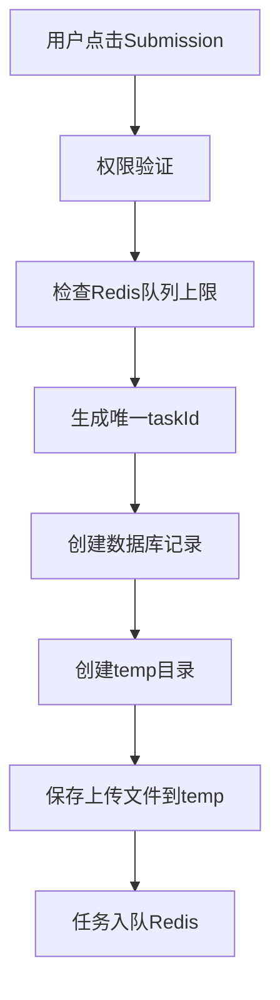
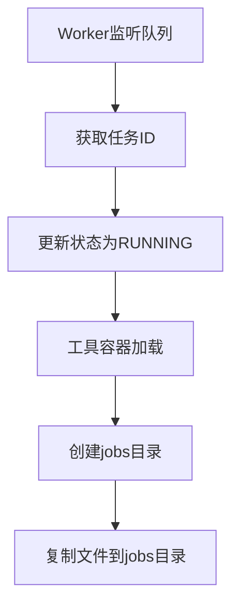
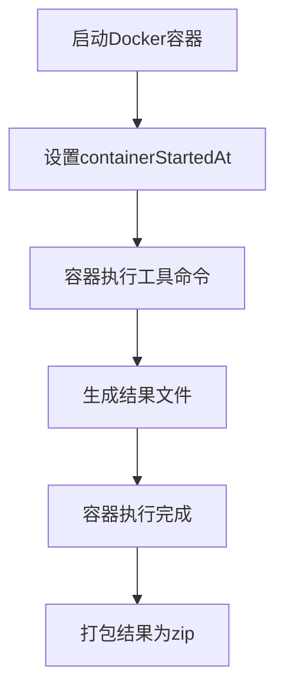
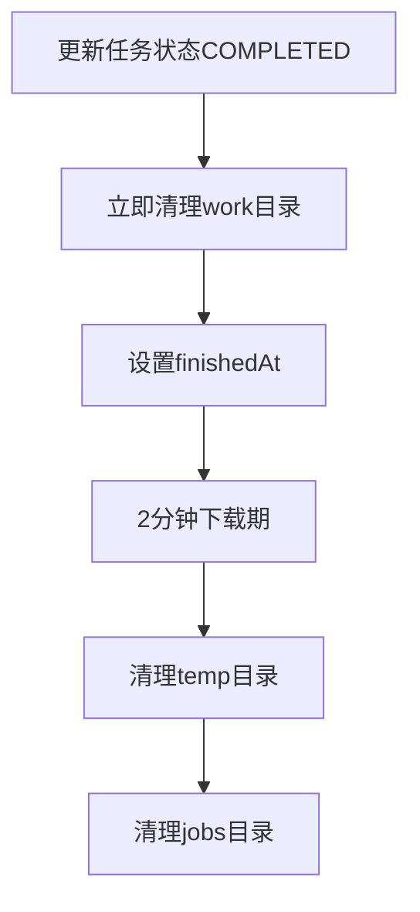

# 工具执行完整流程详细文档

## 📋 概述

本文档详细描述了从用户提交任务到结果数据生成的完整工具执行流程，包括每一步的条件、实际操作和结果。

## 🔄 完整执行流程

### 阶段1：任务提交与准备 (Frontend → Backend API)

#### 1.1 用户提交任务
- **触发条件**: 用户在前端页面点击"Submission"按钮
- **实际操作**:
  - 前端收集表单数据和上传文件
  - 发送POST请求到`/api/tools/{toolId}/execute`
- **结果**: 任务提交请求到达后端

#### 1.2 权限验证
- **触发条件**: 后端接收到任务提交请求
- **实际操作**:
  - 检查用户认证状态（JWT验证）
  - 验证用户订阅权限（查询subscription表）
  - 检查并发任务限制（根据用户类型）
  - 确定用户权限类型（pro/free）
- **结果**: 权限验证通过，获得用户权限类型

#### 1.3 检查Redis队列上限
- **触发条件**: 权限验证通过
- **实际操作**:
  - 查询Redis队列`task_queue`当前长度
  - 检查是否超过最大限制（48个任务）
  - 如果队列已满，立即拒绝任务
- **结果**: 队列容量检查通过

#### 1.4 生成唯一任务ID
- **触发条件**: 队列容量检查通过
- **实际操作**:
  - 使用`TaskIdGeneratorService.generateTaskId()`生成UUID
  - 确保任务ID全局唯一
- **结果**: 获得唯一任务标识符

#### 1.5 创建数据库记录
- **触发条件**: 任务ID生成成功
- **实际操作**:
  - 在Task表中创建记录，设置初始状态为`PENDING`
  - 记录用户ID、工具ID、参数、权限类型等
  - 设置`queuedAt`时间戳和重试相关字段
  - 设置`retryCount=0`, `maxRetries=3`
- **结果**: 任务记录持久化到数据库

#### 1.6 创建temp目录
- **触发条件**: 数据库记录创建成功
- **实际操作**:
  - 使用`FileSystemLockService.safeCreateDirectory()`创建`temp/{taskId}/`目录
  - 设置目录权限，确保线程安全
- **结果**: temp目录准备就绪

#### 1.7 保存上传文件到temp目录
- **触发条件**: temp目录创建成功
- **实际操作**:
  - 将用户上传的文件保存到`temp/{taskId}/`
  - 验证文件格式和大小
  - 记录文件名列表到任务参数中
- **结果**: 输入文件安全存储到temp目录

#### 1.8 任务入队
- **触发条件**: 文件保存成功
- **实际操作**:
  - 使用`redisPool.atomicEnqueueIfNotFull()`原子性入队
  - 将任务ID推入Redis队列`task_queue`
  - 立即增加用户使用计数
- **结果**: 任务等待Worker处理

### 阶段2：Worker获取与准备 (Worker Process)

#### 2.1 Worker监听队列
- **触发条件**: Worker进程启动并运行
- **实际操作**:
  - Worker进程执行`redis_client.blpop('task_queue', timeout=30)`
  - 阻塞等待任务到达，支持多Worker并发
- **结果**: Worker处于就绪状态

#### 2.2 Worker获取任务ID
- **触发条件**: Redis队列中有任务
- **实际操作**:
  - Worker从队列头部原子性获取任务ID
  - 开始处理任务，避免重复处理
- **结果**: Worker获得具体任务

#### 2.3 更新任务状态为RUNNING
- **触发条件**: Worker获取到任务ID
- **实际操作**:
  - 更新数据库：`status = 'RUNNING'`
  - 设置`startedAt = now()`（Worker开始处理时间）
  - 记录`workerId`标识
- **结果**: 任务状态变为运行中

#### 2.4 工具容器加载
- **触发条件**: 任务状态更新成功
- **实际操作**:
  - 调用`check_local_image_exists(image_name)`检查本地镜像
  - 如果镜像不存在，从tar文件加载：`load_image_from_tar()`
  - 从`docker/images/{tool}/logiccore_{tool}-generator_latest.tar`加载
  - 验证镜像加载成功
- **结果**: Docker镜像准备就绪

#### 2.5 创建jobs目录
- **触发条件**: 镜像验证成功
- **实际操作**:
  - 调用`file_manager.create_directories(module_name, tool_type)`
  - 创建`jobs/{taskId}/`完整目录结构
  - 包含input、output、logs、work子目录
  - 创建工具特定目录：`work/{modName}/{toolType}/inputs`
- **结果**: 任务工作目录准备就绪

#### 2.6 复制数据到jobs目录
- **触发条件**: jobs目录创建成功
- **实际操作**:
  - 调用`process_temp_files()`从temp目录复制文件
  - 复制到`jobs/{taskId}/input/`目录
  - 复制到`jobs/{taskId}/work/{modName}/{toolType}/inputs/`目录
  - 验证文件完整性和大小
- **结果**: 输入文件准备完毕，分布在两个目标目录

### 阶段3：容器启动执行工具命令 (Docker Container)

#### 3.1 启动Docker容器
- **触发条件**: 文件复制完成
- **实际操作**:
  - 生成唯一容器名称：`generate_unique_container_name(task.id)`
  - 配置容器挂载：`jobs/{taskId}:/jobs`
  - 设置安全参数：网络隔离、只读文件系统、资源限制
  - 启动容器：`docker_client.containers.run()`
- **结果**: 容器开始运行

#### 3.2 设置容器开始时间
- **触发条件**: 容器启动成功
- **实际操作**:
  - 更新数据库：`task.containerStartedAt = datetime.now(timezone.utc)`
  - 这是3分钟超时计算的精确起点
  - 提交数据库事务确保时间记录
- **结果**: 超时计时开始，3分钟倒计时启动

#### 3.3 容器执行工具命令
- **触发条件**: 容器运行中
- **实际操作**:
  - 容器内执行工具脚本（SDC/UPF生成器）
  - 读取`/jobs/input/`和`/jobs/work/{modName}/{toolType}/inputs/`中的输入文件
  - 根据工具类型执行相应的处理逻辑
  - 生成工具特定的输出文件
- **结果**: 工具处理完成，生成原始结果

#### 3.4 生成结果文件
- **触发条件**: 工具执行成功
- **实际操作**:
  - 在`/jobs/output/`目录生成结果文件
  - SDC工具：生成.sdc文件和相关约束文件
  - UPF工具：生成.upf文件和电源管理文件
  - 同时生成执行日志和报告文件
- **结果**: 原始结果文件生成到output目录

#### 3.5 生成结果并打包到jobs/{taskId}/output
- **触发条件**: 容器执行完成且退出码为0
- **实际操作**:
  - 调用`file_manager.package_results()`打包结果
  - 将output、logs目录内容打包为`{taskId}_{toolName}.zip`
  - 压缩包保存到`jobs/{taskId}/output/`目录
  - 更新任务元数据记录结果文件路径
- **结果**: 压缩包准备就绪，可供下载

### 阶段4：任务完成与清理 (Worker Process)

#### 4.1 更新任务完成状态
- **触发条件**: 容器执行成功并生成zip文件
- **实际操作**:
  - 更新数据库：`status = 'COMPLETED'`
  - 设置`finishedAt = now()`
  - 记录`outputFile`路径到数据库
  - 更新任务元数据文件
- **结果**: 任务标记为完成，状态持久化

#### 4.2 立即清理jobs/{taskId}/work目录
- **触发条件**: 结果打包完成后立即执行
- **实际操作**:
  - 获取work目录路径：`file_manager.get_work_dir()`
  - 使用`shutil.rmtree(work_dir)`删除整个work目录
  - 保留input和output目录用于下载
  - 记录清理日志
- **结果**: work目录清理完成，节省存储空间

#### 4.3 开始2分钟下载期
- **触发条件**: 任务状态更新为COMPLETED
- **实际操作**:
  - 用户可以通过API下载结果文件
  - 启动2分钟倒计时机制
  - 下载服务监控下载状态
- **结果**: 用户获得2分钟下载机会

#### 4.4 2分钟下载期后清理temp/{taskId}目录
- **触发条件**: 2分钟下载期结束
- **实际操作**:
  - 调用`cleanup_temp_files(task_id, "task_completed")`
  - 检查任务完成时间，确认已过2分钟
  - 删除`temp/{taskId}/`目录及所有内容
  - 释放存储空间
- **结果**: temp目录清理完成

#### 4.5 清理jobs目录（通过清理服务）
- **触发条件**: 2分钟下载期结束
- **实际操作**:
  - 清理服务定期检查任务状态
  - 验证清理条件：任务完成且下载期满
  - 删除`jobs/{taskId}/`目录及所有内容
  - 释放存储空间
- **结果**: jobs目录清理完成，任务生命周期结束

## ⚠️ 异常处理流程

### 超时处理
- **队列超时**: 35分钟后自动清理
- **执行超时**: 3分钟后标记失败
- **下载超时**: 2分钟后清理文件

### 重试机制
- **最大重试次数**: 3次
- **重试条件**: Worker崩溃、容器中止、执行超时
- **重试逻辑**: 检查temp目录数据，重新入队

### 资源清理
- **立即清理**: 任务失败且无重试机会
- **延迟清理**: 任务完成后2分钟
- **强制清理**: 超时或达到最大重试次数

## 📊 关键时间节点

| 时间点 | 字段 | 说明 |
|--------|------|------|
| 任务创建 | `createdAt` | 用户提交时间 |
| 入队时间 | `queuedAt` | 进入Redis队列时间 |
| 开始处理 | `startedAt` | Worker获取任务时间 |
| 容器启动 | `containerStartedAt` | 容器真正开始执行时间（超时计算起点） |
| 任务完成 | `finishedAt` | 任务执行完成时间 |

## 🔧 目录生命周期

### temp目录
- **创建**: 用户提交任务时
- **使用**: 存储用户上传文件
- **清理**: 任务完成2分钟后 OR 队列超时 OR 最大重试后

### jobs目录  
- **创建**: Worker获取任务且镜像加载后
- **使用**: 容器执行工作目录
- **清理**: 任务完成2分钟后 OR 执行超时 OR Worker崩溃

这个完整流程确保了任务执行的可靠性、可追踪性和资源的有效管理。
