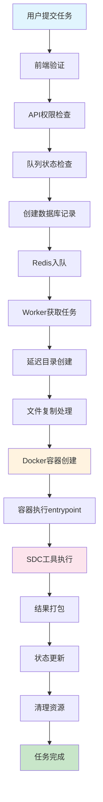
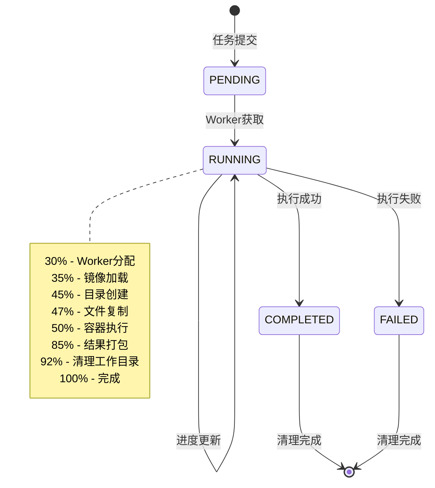

# SDC工具执行流程深度分析文档（修正版）

## 📋 概述

本文档深入分析SDC工具从用户提交任务开始，直到工具完成任务生成zip压缩文件为止的完整执行流程。基于实际代码逻辑，详细阐述前后端系统的操作步骤、函数调用关系、参数传递、数据流、数据库状态更新、Docker容器执行机制等各个方面。

## ⚠️ 重要修正说明

**执行方式澄清**: SDC工具的实际执行是通过**Docker容器**完成的，而不是直接执行shell脚本。容器内部运行entrypoint脚本，该脚本调用Python工具进行SDC生成。

## 🔄 完整执行流程概览（ECS Only模式）

```
用户提交任务 → 权限验证 → 队列检查 → 数据库记录 → Redis入队 →
Worker获取 → 延迟目录创建 → 文件复制 → Docker容器执行 → 结果打包 → 状态更新
```

## 📝 详细步骤分析

### 阶段1：前端用户提交 (SdcGeneratorPage.tsx)

#### 步骤1.1：用户输入验证
**文件位置**: `app/frontend/src/pages/tools/SdcGeneratorPage.tsx:278-361`

**函数**: `onSubmit(data: SdcFormValues)`

**操作逻辑**:
1. 设置任务状态为 `VALIDATING`
2. 验证ModName格式（字母、数字、下划线）
3. 检查必需文件（hier.yaml, vlog.v, dcont.xlsx）
4. 文件内容验证（YAML语法、Verilog语法、Excel格式）

**参数传递**:
```typescript
{
  modName: string,
  isFlat: boolean,
  hierYamlFile: File,
  vlogFile: File,
  dcontFile: File
}
```

**错误处理**: 验证失败时显示错误提示，重置状态为 `IDLE`

#### 步骤1.2：任务提交调用
**文件位置**: `app/frontend/src/hooks/useToolExecution.ts:178-260`

**函数**: `submitTask({ toolId, parameters, inputFiles })`

**操作逻辑**:
1. 检查用户认证状态
2. 重置下载状态，设置状态为 `SUBMITTING`
3. 构建FormData对象
4. 调用API `POST /api/v1/tasks`

**数据流**:
```typescript
FormData {
  toolId: 'sdc-generator',
  parameters: JSON.stringify({ modName, isFlat }),
  files: [hierYamlFile, vlogFile, dcontFile]
}
```

### 阶段2：后端API处理 (task.controller.ts)

#### 步骤2.1：中间件验证链
**文件位置**: `app/backend/src/routes/task.routes.ts:40-46`

**中间件顺序**:
1. `authenticateToken` - JWT令牌验证
2. `checkTaskExecutionPermission` - 任务执行权限检查
3. `upload.array('files')` - 文件上传处理（Multer）
4. `validate(submitTaskSchema)` - 请求参数验证

**权限检查逻辑**:
- 验证用户订阅状态
- 检查任务配额限制
- 验证工具访问权限

#### 步骤2.2：队列状态检查
**文件位置**: `app/backend/src/controllers/task.controller.ts:49-67`

**函数**: `taskQueueService.checkQueueStatus(userId)`

**操作逻辑**:
1. 检查Redis队列长度（上限48个任务）
2. 检查用户并发任务数量
3. 返回队列状态和等待信息

**错误处理**: 队列满时返回429状态码，允许重复提交

#### 步骤2.3：任务创建
**文件位置**: `app/backend/src/controllers/task.controller.ts:70`

**函数**: `taskService.createTask(req.body, userId, files)`

### 阶段3：任务服务处理 (task.service.ts)

#### 步骤3.1：任务ID生成
**文件位置**: `app/backend/src/services/task.service.ts:20`

**函数**: `TaskIdGeneratorService.generateUniqueTaskId()`

**操作逻辑**:
- 生成CUID格式的唯一任务ID
- 确保数据库中不存在重复ID

#### 步骤3.2：任务日志器初始化
**文件位置**: `app/backend/src/services/task.service.ts:30`

**函数**: `createTaskLogger(taskId, userId, username, toolId)`

**操作逻辑**:
- 创建任务专用日志器
- 记录任务提交开始事件

#### 步骤3.3：执行上下文准备
**文件位置**: `app/backend/src/services/task.service.ts:42-85`

**函数**: `ToolExecutionService.prepareExecutionContext()`

**操作逻辑**:
1. 验证工具ID映射
2. 获取工具配置信息
3. 设置部署模式
4. 准备任务参数

**参数处理**:
```typescript
taskParameters = {
  ...originalParameters,
  moduleName: modName,
  toolType: 'sdcgen',
  inputFiles: files.map(file => ({
    originalname: file.originalname,
    mimetype: file.mimetype,
    size: file.size,
    buffer: file.buffer.toString('base64')
  }))
}
```

#### 步骤3.4：临时目录创建
**文件位置**: `app/backend/src/services/task.service.ts:87-142`

**操作逻辑**:
1. 创建 `temp/{taskId}` 目录
2. 保存上传文件到临时目录
3. 创建任务元数据文件

**目录结构**:
```
temp/{taskId}/
├── hier.yaml
├── vlog.v
├── dcont.xlsx
└── metadata.json
```

#### 步骤3.5：数据库记录创建
**文件位置**: `app/backend/src/services/task.service.ts:118-142`

**函数**: `prisma.task.create()`

**数据库字段**:
```typescript
{
  id: taskId,
  userId: userId,
  toolId: actualToolId,
  status: 'PENDING',
  deploymentMode: 'ecs_only',
  queuedAt: new Date(),
  inputFile: null, // 延迟设置
  localStoragePath: taskId,
  parameters: taskParameters,
  retryCount: 0,
  maxRetries: 3
}
```

#### 步骤3.6：Redis队列入队
**文件位置**: `app/backend/src/services/task.service.ts:195-215`

**函数**: `redisPool.atomicEnqueueIfNotFull('task_queue', task.id, maxQueueLength)`

**操作逻辑**:
1. 原子性检查队列长度
2. 如果未满则入队任务ID
3. 失败时清理已创建资源

**错误处理**: 入队失败时删除数据库记录和临时目录

### 阶段4：Worker任务处理（延迟目录创建模式）

#### 步骤4.1：Worker获取任务和资源分配
**文件位置**: `app/backend/src/workers/toolWorker.py:1962-1976`

**函数调用链**:
```python
# 主Worker循环
while self.running:
    # 阻塞式获取任务
    _, task_id_bytes = redis_client.blpop(TASK_QUEUE_NAME, timeout=0)
    task_id = task_id_bytes.decode('utf-8')

    # 资源分配检查
    if not rm.try_allocate_resources(task_id):
        redis_client.lpush(TASK_QUEUE_NAME, task_id)  # 重新入队
        time.sleep(5)
        continue

    # 处理任务
    process_task(task_id)
```

**资源管理详解**:
```python
# 资源配置
JOB_CPU_REQUEST = 2          # 每任务2核心
JOB_MEMORY_REQUEST_GB = 2    # 每任务2GB内存
ECS_TOTAL_CPU = 16           # 总CPU核心数
ECS_TOTAL_MEMORY_GB = 16     # 总内存

# 并发限制计算
max_concurrent_tasks = min(
    ECS_TOTAL_CPU // JOB_CPU_REQUEST,      # 8个任务
    ECS_TOTAL_MEMORY_GB // JOB_MEMORY_REQUEST_GB  # 8个任务
) = 8个并发任务
```

#### 步骤4.2：任务状态更新和上下文初始化
**文件位置**: `app/backend/src/workers/toolWorker.py:1083-1103`

**状态更新机制**:
```python
# 直接数据库更新（不通过API）
task.status = 'RUNNING'
task.startedAt = datetime.now(timezone.utc)
session.commit()

# 进度更新函数
def update_task_progress(self, current_step, shared_session=None):
    task = session.query(Task).filter(Task.id == self.task_id).first()
    task.progress = step_progress_mapping.get(current_step, 0)
    task.currentStep = current_step
    task.stepStartedAt = datetime.now(timezone.utc)
    session.commit()
    session.flush()  # 立即写入数据库
```

**任务上下文初始化**:
```python
# app/backend/src/workers/toolWorker.py:582-603
def initialize_task_context(task, task_logger, session):
    params = task.parameters or {}
    module_name = params.get('moduleName', 'default_module')  # 从modName转换
    tool_type = params.get('toolType', 'sdcgen')

    # 初始化ECS本地文件管理器
    file_manager = EcsLocalFileManager(task.id, task.userId)

    # 获取工具信息
    tool = session.query(Tool).filter_by(id=task.toolId).first()

    return module_name, tool_type, file_manager, tool, params
```

#### 步骤4.3：延迟目录创建（关键改进）
**文件位置**: `app/backend/src/workers/toolWorker.py:1225-1233`

**重要说明**: 与之前的实现不同，现在采用**延迟目录创建**策略：

```python
# 任务提交时：只创建temp/{taskId}目录
# Worker获取时：才创建jobs/{taskId}目录

# 步骤10：创建jobs目录结构
task_logger.log_step_start('JOBS_DIRECTORY_CREATION', 'Creating jobs directory structure after image verification')
task_logger.update_task_progress('JOBS_DIRECTORY_CREATION', session)
file_manager.create_directories(module_name, tool_type)
```

**目录结构创建**:
```python
# EcsLocalFileManager.create_directories()
def create_directories(self, module_name, tool_type):
    # 创建基础目录
    os.makedirs(f'jobs/{task_id}/input', exist_ok=True)
    os.makedirs(f'jobs/{task_id}/output', exist_ok=True)
    os.makedirs(f'jobs/{task_id}/logs', exist_ok=True)
    os.makedirs(f'jobs/{task_id}/work', exist_ok=True)

    # 创建工具特定目录
    tool_work_dir = f'jobs/{task_id}/work/{module_name}/{tool_type}/inputs'
    os.makedirs(tool_work_dir, exist_ok=True)
```

**最终目录结构**:
```
jobs/{taskId}/
├── input/                    # 原始输入文件
├── output/                   # 最终输出文件
├── logs/                     # 执行日志
└── work/                     # 工作目录
    └── {moduleName}/         # 用户指定的模块名
        └── sdcgen/           # 工具类型目录
            └── inputs/       # 工具输入目录
```

#### 步骤4.4：文件复制处理（temp → jobs）
**文件位置**: `app/backend/src/workers/toolWorker.py:2026-2070`

**函数**: `process_temp_files(task, task_logger, file_manager)`

**详细复制逻辑**:
```python
def process_temp_files(task, task_logger, file_manager):
    # 1. 从数据库参数中反序列化文件
    input_files = task.parameters.get('inputFiles', [])

    # 2. 重建temp目录中的文件
    temp_dir = f'temp/{task.id}'
    for file_info in input_files:
        file_path = os.path.join(temp_dir, file_info['originalname'])
        file_data = base64.b64decode(file_info['buffer'])
        with open(file_path, 'wb') as f:
            f.write(file_data)

    # 3. 复制到jobs/input目录
    input_dir = file_manager.get_input_dir()  # jobs/{taskId}/input
    for file_name in os.listdir(temp_dir):
        shutil.copy2(
            os.path.join(temp_dir, file_name),
            os.path.join(input_dir, file_name)
        )

    # 4. 复制到工具特定目录
    tool_work_dir = file_manager.get_tool_work_dir(module_name, tool_type)
    work_inputs_dir = os.path.join(tool_work_dir, 'inputs')
    for file_name in os.listdir(input_dir):
        shutil.copy2(
            os.path.join(input_dir, file_name),
            os.path.join(work_inputs_dir, file_name)
        )
```

**文件流转路径**:
```
数据库Task.parameters.inputFiles (base64编码)
  ↓ [Worker反序列化]
temp/{taskId}/{hier.yaml, vlog.v, dcont.xlsx}
  ↓ [复制到input目录]
jobs/{taskId}/input/{hier.yaml, vlog.v, dcont.xlsx}
  ↓ [复制到工具目录]
jobs/{taskId}/work/{moduleName}/sdcgen/inputs/{hier.yaml, vlog.v, dcont.xlsx}
```

### 阶段5：Docker容器执行（核心执行阶段）

#### 步骤5.1：容器管理器创建容器
**文件位置**: `app/backend/src/workers/toolWorker.py:1307-1321`
**容器管理器**: `app/backend/src/workers/container_manager.py:30-62`

**函数调用链**:
```python
# Worker调用
container = container_manager.create_container(
    task.id, image_name, command=["run"],
    environment=env_vars, volumes=volumes, ...
)

# 容器管理器实现
def create_container(self, task_id: str, image_name: str, **kwargs):
    container_name = f"tool-job-{task_id}"
    container = self.docker_client.containers.run(
        image_name, name=container_name, detach=True,
        remove=False, **kwargs  # 手动控制删除
    )
    # 记录到活跃容器跟踪列表
    self.active_containers[task_id] = {...}
```

**容器配置详解**:
```python
{
  # 基础配置
  image: 'logiccore/sdc-generator:latest',
  name: f'tool-job-{task_id}',  # 唯一容器名
  command: ['run'],  # 传递给entrypoint脚本
  detach: True,      # 后台运行
  remove: False,     # 手动控制删除

  # 环境变量
  environment: {
    'TASK_ID': task.id,
    'SDC_MOD_NAME': module_name,
    'SDC_IS_FLAT': str(is_flat).lower(),
    'USER_PERMISSION_TYPE': user_permission,
    'JOB_INPUT_DIR': '/data/input',
    'JOB_OUTPUT_DIR': '/data/output',
    'JOB_LOG_DIR': '/data/logs'
  },

  # 目录挂载（宿主机 → 容器）
  volumes: {
    f'{ecs_jobs_dir}/{task_id}/input':  {'bind': '/data/input',  'mode': 'ro'},
    f'{ecs_jobs_dir}/{task_id}/output': {'bind': '/data/output', 'mode': 'rw'},
    f'{ecs_jobs_dir}/{task_id}/logs':   {'bind': '/data/logs',   'mode': 'rw'},
    f'{ecs_jobs_dir}/{task_id}/work':   {'bind': '/data/work',   'mode': 'rw'}
  },

  # 资源限制
  nano_cpus: int(float(JOB_CPU_REQUEST) * 1e9),  # 2 CPU cores
  mem_limit: f"{JOB_MEMORY_REQUEST_GB}g",        # 2GB memory

  # 安全配置
  network_mode: 'none',           # 禁用网络
  cap_drop: ['ALL'],              # 移除所有Linux权限
  read_only: True,                # 只读根文件系统
  tmpfs: {'/tmp': 'rw,noexec,nosuid,size=100m'},
  security_opt: ['no-new-privileges:true']
}
```

#### 步骤5.2：容器等待和监控
**文件位置**: `app/backend/src/workers/toolWorker.py:1323-1331`

**执行逻辑**:
```python
# 等待容器完成
result = container.wait()
exit_code = result['StatusCode']
logs = container.logs().decode('utf-8')

# 记录容器日志到宿主机
log_file = os.path.join(file_manager.get_log_dir(), 'container.log')
with open(log_file, 'w') as f:
    f.write(logs)
```

#### 步骤5.3：容器内部执行流程
**文件位置**: `app/backend/src/tools/scripts/sdc_entrypoint.sh`

**Entrypoint脚本执行步骤**:

1. **环境变量检查** (行24-43):
```bash
check_env_vars() {
    required_vars=("SDC_MOD_NAME" "SDC_IS_FLAT" "JOB_INPUT_DIR"
                   "JOB_OUTPUT_DIR" "JOB_LOG_DIR" "TASK_ID")
    # 验证所有必需环境变量
}
```

2. **输入文件验证** (行46-63):
```bash
check_input_files() {
    required_files=("$JOB_INPUT_DIR/hier.yaml"
                   "$JOB_INPUT_DIR/vlog.v"
                   "$JOB_INPUT_DIR/dcont.xlsx")
    # 检查文件存在性
}
```

3. **工作空间初始化** (行66-85):
```bash
init_workspace() {
    cd /data/work
    # 调用Python工具创建目录结构
    python3 /app/sdcgen/sdcgen.py sdcgen -gen_dir ./ -blocks "$SDC_MOD_NAME" -setup
}
```

4. **配置文件放置** (行88-135):
```bash
place_config_files() {
    local input_dir="/data/work/$SDC_MOD_NAME/sdcgen/inputs"
    # 智能文件复制（支持不同扩展名）
    # hier.yaml ← *.yaml/*.yml
    # vlog.v ← *.v/*.sv
    # dcont.xlsx ← *.xlsx/*.xls
}
```

5. **输入信息检查** (行138-150):
```bash
check_input_info() {
    python3 /app/sdcgen/sdcgen.py sdcgen -gen_dir ./ \
        -hier_yaml "$SDC_MOD_NAME/sdcgen/inputs/hier.yaml" \
        -chk_only -blocks "$SDC_MOD_NAME"
}
```

6. **SDC文件生成** (行153-175):
```bash
generate_sdc() {
    if [[ "$SDC_IS_FLAT" == "true" ]]; then
        python3 /app/sdcgen/sdcgen.py sdcgen -gen_dir ./ \
            -hier_yaml "$SDC_MOD_NAME/sdcgen/inputs/hier.yaml" \
            -blocks "$SDC_MOD_NAME" -sdc -flatten -usr "$user_permission"
    else
        python3 /app/sdcgen/sdcgen.py sdcgen -gen_dir ./ \
            -hier_yaml "$SDC_MOD_NAME/sdcgen/inputs/hier.yaml" \
            -blocks "$SDC_MOD_NAME" -sdc -usr "$user_permission"
    fi
}
```

7. **输出文件检查** (行178-196):
```bash
check_sdc_files() {
    # 验证生成的SDC文件（可选步骤）
    python3 /app/sdcgen/sdcgen.py sdcgen -gen_dir ./ \
        -hier_yaml "$SDC_MOD_NAME/sdcgen/inputs/hier.yaml" \
        -blocks "$SDC_MOD_NAME" -chk_sdc [-flatten]
}
```

8. **结果打包** (行199-286):
```bash
package_output() {
    local sdc_base_dir="$SDC_MOD_NAME/sdcgen"
    local output_zip="/data/output/sdc_result.zip"

    # 打包三个目录: outputs/, logs/, rpts/
    cd "$sdc_base_dir"
    zip -r "$output_zip" outputs/ logs/ rpts/

    # 生成详细摘要文件
    cat > /data/output/result_summary.txt << EOF
    # 包含任务信息、文件统计、生成结果等
    EOF
}
```

### 阶段6：结果处理和清理

#### 步骤6.1：结果打包
**文件位置**: `app/backend/src/workers/toolWorker.py:1334-1342`

**操作逻辑**:
1. 检查容器退出码
2. 收集容器日志
3. 打包输出文件为ZIP格式
4. 更新任务元数据

**打包内容**:
```
sdc_result.zip
├── outputs/        # SDC生成文件
├── logs/           # 执行日志
└── rpts/           # 报告文件
```

#### 步骤6.2：工作目录清理
**文件位置**: `app/backend/src/workers/toolWorker.py:1345-1358`

**操作逻辑**:
1. 立即清理 `jobs/{taskId}/work` 目录
2. 保留input、output、logs目录
3. 记录清理操作日志

#### 步骤6.3：任务状态更新
**文件位置**: `app/backend/src/workers/toolWorker.py:1361-1387`

**操作逻辑**:
1. 更新数据库任务状态为 `COMPLETED`
2. 设置完成时间和输出文件路径
3. 调用内部API更新状态

**数据库更新**:
```sql
UPDATE Task SET 
  status = 'COMPLETED',
  finishedAt = NOW(),
  outputFile = 'sdc_result.zip',
  progress = 100
WHERE id = taskId;
```

#### 步骤6.4：定时清理任务
**操作逻辑**:
1. 2分钟后清理 `temp/{taskId}` 目录
2. 2分钟下载期后清理 `jobs/{taskId}` 目录
3. 容器自动清理

## 🔍 数据流深度分析

### 输入数据流（详细路径）
```
用户上传文件
  ↓ [前端验证]
FormData(files + parameters)
  ↓ [POST /api/v1/tasks]
后端API接收(Multer处理)
  ↓ [task.service.ts:87-142]
临时存储 temp/{taskId}/ {hier.yaml, vlog.v, dcont.xlsx}
  ↓ [数据库序列化存储]
Task.parameters.inputFiles = [base64编码的文件数据]
  ↓ [Redis队列]
task_queue.push(taskId)
  ↓ [Worker获取]
Worker.process_task_ecs_only()
  ↓ [延迟目录创建]
jobs/{taskId}/{input,output,logs,work}/
  ↓ [文件复制]
temp/{taskId}/* → jobs/{taskId}/input/*
jobs/{taskId}/input/* → jobs/{taskId}/work/{moduleName}/sdcgen/inputs/*
  ↓ [容器挂载]
宿主机jobs/{taskId}/* → 容器/data/*
```

### 输出数据流（详细路径）
```
容器内Python工具执行
  ↓ [SDC生成]
/data/work/{moduleName}/sdcgen/outputs/*.sdc
  ↓ [容器内打包]
/data/output/sdc_result.zip (包含outputs/, logs/, rpts/)
  ↓ [挂载映射]
容器/data/output/* → 宿主机jobs/{taskId}/output/*
  ↓ [Worker处理]
file_manager.package_results() → 验证zip文件
  ↓ [数据库更新]
Task.outputFile = 'sdc_result.zip', status = 'COMPLETED'
  ↓ [用户下载]
GET /api/v1/tasks/{taskId}/download
  ↓ [定时清理]
2分钟后: temp/{taskId}/ 和 jobs/{taskId}/ 目录删除
```

### 状态流转（详细进度）
```
PENDING (0%)
  ↓ [Worker获取]
RUNNING (30%) - WORKER_ASSIGNED
  ↓ [镜像加载]
RUNNING (35%) - CONTAINER_IMAGE_LOADING
  ↓ [目录创建]
RUNNING (45%) - JOBS_DIRECTORY_CREATION
  ↓ [文件复制]
RUNNING (47%) - TEMP_TO_JOBS_COPY
  ↓ [容器执行]
RUNNING (50%) - CONTAINER_EXECUTION
  ↓ [结果打包]
RUNNING (85%) - RESULT_PACKAGING
  ↓ [清理工作目录]
RUNNING (92%) - WORK_DIRECTORY_CLEANUP
  ↓ [任务完成]
COMPLETED (100%)
```

## ⚠️ 错误处理和清理机制深度分析

### 前端错误处理（详细状态码处理）
**文件位置**: `app/frontend/src/hooks/useToolExecution.ts:231-260`

```typescript
// 状态码分类处理
if (status === 401) {
    // 未认证：跳转登录页
    navigate('/auth/login', { state: { from: location } });
} else if (status === 403) {
    // 权限不足：订阅或配额问题
    if (message.includes('subscription')) {
        handleApiError(error, "您需要有效的订阅才能使用此功能");
    } else if (message.includes('daily limit')) {
        handleApiError(error, "您今日的任务配额已用完");
    }
} else if (status === 429) {
    // 队列满：允许重复提交
    setTaskStatus(prev => ({ ...prev, status: 'IDLE' }));
    toast({ title: "队列繁忙", description: queueMessage });
}
```

### 后端错误处理（分层处理机制）
**文件位置**: `app/backend/src/controllers/task.controller.ts:92-112`

```typescript
// API层错误处理
try {
    const task = await taskService.createTask(req.body, userId, files);
    res.status(202).json({ success: true, data: task });
} catch (error) {
    if ((error as Error).message.includes('not found')) {
        return res.status(404).json({ success: false, code: 'NOT_FOUND' });
    }
    res.status(500).json({ success: false, code: 'INTERNAL_ERROR' });
}
```

**服务层错误处理**:
```typescript
// 原子性入队失败处理
if (!enqueueSuccess) {
    // 清理已创建的资源
    await FileSystemLockService.safeRemoveDirectory(tempDir);
    await prisma.task.delete({ where: { id: task.id } });
    throw new Error('任务入队失败，请稍后再试');
}
```

### Worker错误处理（多层清理机制）
**文件位置**: `app/backend/src/workers/toolWorker.py:1389-1397`

```python
# 异常处理和清理
except Exception as e:
    task_logger.log('ERROR', 'PROCESS', f'ECS only processing failed: {str(e)}')
    try:
        # 清理临时文件
        cleanup_temp_files(task.id, task_logger, "task_failed")
        # 清理容器
        cleanup_container_for_task(task.id, "task_exception")
    except Exception as cleanup_error:
        task_logger.log('ERROR', 'CLEANUP', f'Failed to cleanup: {str(cleanup_error)}')
    return False
```

**超时处理机制**:
```python
# app/backend/src/workers/toolWorker.py:1105-1109
success = execute_with_timeout_and_cleanup(
    task_execution,
    timeout_seconds,  # 默认1800秒(30分钟)
    cleanup_manager
)
```

### 容器清理机制（四种清理场景）
**文件位置**: `app/backend/src/workers/container_manager.py:64-115`

**清理场景分类**:
1. **Worker崩溃**: `cleanup_container_for_task(task_id, "worker_crash")`
2. **容器中止**: `cleanup_container_for_task(task_id, "container_abort")`
3. **任务正常完成**: `cleanup_container_for_task(task_id, "task_completed")`
4. **超时清理**: `cleanup_container_for_task(task_id, "timeout_cleanup")`

**清理实现逻辑**:
```python
def cleanup_container(self, task_id: str, force: bool = False, reason: str = "unknown"):
    container_info = self.active_containers.get(task_id)

    if container_info:
        container = container_info['container']
        try:
            container.stop(timeout=10)      # 优雅停止
            container.remove(force=force)   # 强制删除
            del self.active_containers[task_id]  # 从跟踪列表移除
        except Exception as e:
            logger.warning(f"Failed to cleanup container: {e}")

    # 备用清理：通过容器名称
    try:
        container_name = f"tool-job-{task_id}"
        container = self.docker_client.containers.get(container_name)
        container.stop(timeout=10)
        container.remove(force=force)
    except docker.errors.NotFound:
        pass  # 容器不存在，清理成功
```

### 文件系统清理机制
**清理时机和策略**:

1. **立即清理** (任务完成后):
```python
# 清理work目录（节省空间）
work_dir = file_manager.get_work_dir()
if os.path.exists(work_dir):
    shutil.rmtree(work_dir)
```

2. **延迟清理** (2分钟后):
```python
# 清理temp目录
cleanup_temp_files(task.id, task_logger, "download_timeout")

# 清理整个jobs目录
schedule_cleanup_task(task.id)  # 2分钟后执行
```

3. **孤儿清理** (定期执行):
```python
# 清理孤立容器
def cleanup_orphaned_containers(self):
    containers = self.docker_client.containers.list(all=True)
    for container in containers:
        if container.name.startswith('tool-job-'):
            task_id = container.name.replace('tool-job-', '')
            if task_id not in self.active_containers:
                container.stop(timeout=10)
                container.remove(force=True)
```

### 数据一致性保障机制

**事务回滚**:
```python
# 任务创建失败时的回滚
try:
    task = await prisma.task.create({...})
    await redisPool.atomicEnqueueIfNotFull('task_queue', task.id)
except Exception:
    # 回滚数据库记录
    await prisma.task.delete({ where: { id: task.id } })
    # 清理文件系统
    await FileSystemLockService.safeRemoveDirectory(tempDir)
```

**状态同步**:
```python
# 确保数据库状态与实际执行状态一致
task.status = 'RUNNING'
session.commit()
session.flush()  # 立即写入，防止回滚
```

## 📊 执行流程可视化图表

### 完整执行流程图


### 数据流转图

```mermaid
graph LR
    subgraph "前端"
        A1[用户上传] --> A2[FormData]
    end

    subgraph "后端API"
        A2 --> B1[Multer处理]
        B1 --> B2[临时存储]
        B2 --> B3[数据库序列化]
    end

    subgraph "Redis队列"
        B3 --> C1[任务入队]
    end

    subgraph "Worker处理"
        C1 --> D1[获取任务]
        D1 --> D2[反序列化文件]
        D2 --> D3[创建jobs目录]
        D3 --> D4[文件复制]
    end

    subgraph "Docker容器"
        D4 --> E1[挂载目录]
        E1 --> E2[执行工具]
        E2 --> E3[生成结果]
    end

    subgraph "结果处理"
        E3 --> F1[打包输出]
        F1 --> F2[用户下载]
        F2 --> F3[定时清理]
    end
```


### 状态转换图


## 📊 性能监控和指标

### 关键性能指标（KPI）
```
1. 任务提交响应时间: < 2秒
2. 队列等待时间: 取决于并发任务数
3. Worker分配时间: < 5秒
4. 目录创建时间: < 10秒
5. 文件复制时间: 取决于文件大小
6. 容器启动时间: < 30秒
7. SDC工具执行时间: 1-10分钟（取决于设计复杂度）
8. 结果打包时间: < 30秒
9. 总执行时间: 2-15分钟
```

### 监控点和日志记录
**TaskLogger实现**:
```python
# 步骤时间记录
def log_step_start(self, step, description):
    self.step_times[step] = time.time()
    self.update_task_progress(step)

def log_step_success(self, step, description):
    duration = time.time() - self.step_times[step]
    self.record_performance_metric(step, duration)
```

**关键监控指标**:
- 每个步骤的开始和结束时间
- 容器资源使用情况（CPU/内存）
- 文件处理大小和速度
- 错误详情和堆栈信息
- 用户操作轨迹和会话信息

## 🔧 配置参数

### 环境变量
```bash
TASK_TIMEOUT_SECONDS=1800      # 任务超时时间
ECS_JOBS_DIR=/data/chipcore/jobs  # 作业目录
TEMP_UPLOAD_DIR=/tmp/logiccore_temp  # 临时目录
REDIS_URL=redis://localhost:6379  # Redis连接
```

### 资源限制
```bash
JOB_CPU_REQUEST=2              # 每任务CPU核心数
JOB_MEMORY_REQUEST_GB=2        # 每任务内存GB
ECS_TOTAL_CPU=16               # 总CPU核心数
ECS_TOTAL_MEMORY_GB=16         # 总内存GB
```

## 🔍 代码逻辑问题分析

### 1. 参数传递一致性问题

#### 问题1.1：modName vs moduleName 参数转换
**问题位置**: 前端使用`modName`，后端转换为`moduleName`

**前端提交**:
```typescript
// SdcGeneratorPage.tsx:343-347
submitTask({
    toolId: 'sdc-generator',
    parameters: { modName, isFlat },  // 使用modName
    inputFiles: inputFiles,
});
```

**后端处理**:
```typescript
// task.service.ts:144-150
taskParameters = {
    ...originalParameters,
    moduleName: parameters.modName,  // 转换为moduleName
    toolType: 'sdcgen',
    inputFiles: files.map(...)
}
```

**Worker使用**:
```python
# toolWorker.py:585-586
module_name = params.get('moduleName', 'default_module')  # 使用moduleName
```

**一致性评估**: ✅ **正确** - 有明确的转换逻辑，保证了参数传递的一致性。

#### 问题1.2：isFlat vs SDC_IS_FLAT 环境变量转换
**转换链路**:
```
前端: isFlat (boolean)
  ↓
后端: parameters.isFlat (boolean)
  ↓
Worker: env_vars['SDC_IS_FLAT'] = str(is_flat).lower() (string)
  ↓
容器: $SDC_IS_FLAT = "true"/"false" (string)
```

**潜在问题**: 类型转换正确，但需要确保容器内脚本正确处理字符串比较。

### 2. 文件处理逻辑问题

#### 问题2.1：延迟目录创建的数据安全性
**当前实现**:
```python
# 任务提交时：文件存储在数据库中（base64编码）
Task.parameters.inputFiles = [base64编码的文件数据]

# Worker处理时：从数据库重建文件
for file_info in input_files:
    file_data = base64.b64decode(file_info['buffer'])
    with open(file_path, 'wb') as f:
        f.write(file_data)
```

**潜在风险**:
- 大文件会导致数据库记录过大
- base64编码增加33%的存储开销
- 数据库事务可能因记录过大而失败

**建议改进**: 考虑使用文件系统存储 + 数据库路径引用的方式。

#### 问题2.2：文件名映射的灵活性
**容器内文件映射**:
```bash
# sdc_entrypoint.sh:100-128
# 支持多种文件扩展名的智能映射
for file in "$JOB_INPUT_DIR"/*.yaml "$JOB_INPUT_DIR"/*.yml; do
    cp "$file" "$input_dir/hier.yaml"  # 统一命名
done
```

**一致性评估**: ✅ **正确** - 提供了良好的文件名兼容性。

### 3. 状态更新机制问题

#### 问题3.1：数据库直接更新 vs API更新的混合使用
**Worker中的状态更新**:
```python
# 直接数据库更新
task.status = 'RUNNING'
session.commit()

# 进度更新也是直接数据库
def update_task_progress(self, current_step, shared_session=None):
    task.progress = progress
    session.commit()
    session.flush()
```

**潜在问题**:
- 绕过了API层的验证和日志记录
- 可能导致前后端状态不同步
- 缺少统一的状态变更审计

**建议**: 考虑使用内部API进行状态更新，保证一致性。

#### 问题3.2：进度映射的准确性
**进度映射定义**:
```python
step_progress_mapping = {
    'WORKER_ASSIGNED': 30,           # Worker获取任务
    'CONTAINER_IMAGE_LOADING': 35,   # 镜像加载
    'JOBS_DIRECTORY_CREATION': 45,   # 目录创建
    'TEMP_TO_JOBS_COPY': 47,        # 文件复制
    'CONTAINER_EXECUTION': 50,       # 容器执行
    'RESULT_PACKAGING': 85,          # 结果打包
    'WORK_DIRECTORY_CLEANUP': 92,    # 清理
    'COMPLETED': 100                 # 完成
}
```

**问题分析**: 容器执行阶段（50%-85%）跨度过大，用户无法了解实际执行进度。

### 4. 错误处理一致性问题

#### 问题4.1：容器执行失败的状态处理
**当前逻辑**:
```python
if exit_code == 0:
    # 成功处理
    task_logger.update_task_progress('COMPLETED', session)
    return True
else:
    # 失败处理
    task_logger.log('ERROR', 'CONTAINER', f'Container failed with exit code {exit_code}')
    cleanup_container_for_task(task.id, "task_failed")
    return False  # 但没有更新数据库状态为FAILED
```

**问题**: 容器执行失败时，任务状态可能停留在RUNNING，而不是FAILED。

#### 问题4.2：清理机制的完整性
**清理时机**:
```python
# 成功时：立即清理work目录，2分钟后清理temp和jobs
# 失败时：清理容器和temp文件，但可能遗留jobs目录
```

**潜在问题**: 失败任务的jobs目录可能不会被及时清理。

### 5. 前后端数据一致性问题

#### 问题5.1：工具ID映射
**前端提交**:
```typescript
toolId: 'sdc-generator'  // 前端使用的ID
```

**后端映射**:
```typescript
// ToolExecutionService.prepareExecutionContext()
const toolMapping = {
    'sdc-generator': 'sdcgen',  // 映射到实际工具ID
    'upf-generator': 'upfgen'
}
```

**一致性评估**: ✅ **正确** - 有明确的映射机制。

#### 问题5.2：任务状态轮询频率
**前端轮询**:
```typescript
// 前端可能每秒轮询任务状态
useEffect(() => {
    const interval = setInterval(pollTaskStatus, 1000);
}, []);
```

**后端更新频率**: Worker按步骤更新，可能几分钟才更新一次。

**潜在问题**: 轮询频率与更新频率不匹配，可能造成用户体验问题。

### 6. 资源管理问题

#### 问题6.1：并发任务的资源竞争
**资源分配逻辑**:
```python
# 简单的资源检查
if rm['cpu_used'] + JOB_CPU_REQUEST > ECS_TOTAL_CPU:
    redis_client.lpush(TASK_QUEUE_NAME, task_id)  # 重新入队
```

**潜在问题**:
- 没有考虑任务执行时间的差异
- 可能导致短任务被长任务阻塞
- 缺少优先级机制

### 7. 安全性问题

#### 问题7.1：容器安全配置
**当前配置**:
```python
# 安全配置
network_mode='none',           # ✅ 禁用网络
cap_drop=['ALL'],              # ✅ 移除所有权限
read_only=True,                # ✅ 只读文件系统
security_opt=['no-new-privileges:true']  # ✅ 禁止权限提升
```

**评估**: ✅ **良好** - 安全配置较为完善。

#### 问题7.2：文件路径安全
**路径构建**:
```python
# 使用用户输入构建路径
module_dir = os.path.join(work_dir, module_name)
```

**潜在风险**: 如果module_name包含路径遍历字符（如../），可能导致安全问题。

**建议**: 添加路径验证和清理。

## 📊 总体评估

### 代码质量评分
- **架构设计**: 8/10 - 分层清晰，职责明确
- **错误处理**: 7/10 - 覆盖较全，但状态更新有遗漏
- **数据一致性**: 7/10 - 大部分一致，但有混合更新模式
- **安全性**: 8/10 - 容器安全配置良好
- **可维护性**: 8/10 - 代码结构清晰，注释详细

### 关键改进建议
1. 统一状态更新机制，避免直接数据库操作
2. 完善容器执行失败时的状态处理
3. 优化大文件的存储策略
4. 增加路径安全验证
5. 改进任务进度的细粒度跟踪

## 🎯 关键发现总结

### 执行方式澄清
**重要修正**: SDC工具的实际执行是通过**Docker容器**完成的，具体流程为：
1. Worker创建Docker容器
2. 容器内运行entrypoint脚本 (`sdc_entrypoint.sh`)
3. Entrypoint脚本调用Python工具 (`sdcgen.py`)
4. Python工具生成SDC文件
5. 容器内打包结果并输出

### 数据流路径确认
```
用户文件 → 前端验证 → 后端API → 数据库序列化 → Worker反序列化
→ jobs目录 → 容器挂载 → 工具执行 → 结果生成 → 打包输出 → 用户下载
```

### 状态更新机制
- **数据库直接更新**: Worker直接操作数据库更新任务状态和进度
- **实时进度跟踪**: 8个关键步骤的进度映射（30%-100%）
- **前端轮询**: 定期获取任务状态和进度信息

### 关键技术特点
1. **延迟目录创建**: 提交时只创建temp目录，Worker获取时才创建jobs目录
2. **容器安全隔离**: 禁用网络、只读文件系统、移除所有权限
3. **多层清理机制**: 立即清理、延迟清理、孤儿清理
4. **资源管理**: 8个并发任务限制（16核心/16GB内存）

## ✅ 系统验证检查清单

### 代码逻辑验证
- [ ] 参数传递一致性：modName → moduleName 转换正确
- [ ] 文件类型映射：前端文件类型与容器内工具要求匹配
- [ ] 状态更新时机：每个关键步骤都有对应的进度更新
- [ ] 错误处理完整性：异常情况下的清理和状态更新

### 数据流验证
- [ ] 文件上传路径：用户文件正确到达容器内工具目录
- [ ] 参数传递路径：前端参数正确传递到容器环境变量
- [ ] 结果输出路径：容器生成的文件正确映射到宿主机
- [ ] 清理机制：临时文件和容器在适当时机被清理

### 性能和资源验证
- [ ] 并发限制：最多8个任务同时执行
- [ ] 资源分配：每个任务2核心/2GB内存
- [ ] 超时处理：30分钟超时机制正常工作
- [ ] 队列管理：48个任务队列上限正确实施

### 安全性验证
- [ ] 容器隔离：网络禁用、权限移除、只读文件系统
- [ ] 路径安全：用户输入的模块名不包含路径遍历
- [ ] 权限检查：任务执行前的用户权限和配额验证
- [ ] 数据隔离：不同用户的任务数据完全隔离

### 用户体验验证
- [ ] 进度显示：用户能看到实时的任务执行进度
- [ ] 错误提示：失败时提供明确的错误信息
- [ ] 下载功能：任务完成后能正常下载结果文件
- [ ] 队列提示：队列满时给出合适的等待提示

## 🔧 推荐改进措施

### 高优先级改进
1. **统一状态更新**: 使用内部API替代直接数据库操作
2. **完善失败处理**: 确保容器执行失败时正确更新任务状态为FAILED
3. **优化大文件处理**: 考虑文件系统存储替代数据库base64编码

### 中优先级改进
1. **细化进度跟踪**: 在容器执行阶段提供更详细的进度信息
2. **增强路径安全**: 添加模块名的路径遍历检查
3. **优化资源调度**: 考虑任务优先级和执行时间预估

### 低优先级改进
1. **监控增强**: 添加更详细的性能指标收集
2. **日志优化**: 统一日志格式和级别
3. **文档完善**: 补充API文档和错误码说明

## 📋 结论

SDC工具执行流程的代码实现总体上是**健壮和安全的**，采用了Docker容器隔离、多层错误处理、资源管理等最佳实践。主要的执行逻辑清晰，数据流路径明确，状态管理基本完善。

**核心优势**:
- 容器化执行保证了安全性和隔离性
- 延迟目录创建优化了资源使用
- 多层清理机制防止了资源泄漏
- 详细的日志记录便于问题诊断

**需要关注的问题**:
- 状态更新机制的一致性
- 大文件处理的效率
- 容器执行失败时的状态处理

通过本文档的深度分析，可以确认SDC工具执行流程在ECS Only部署模式下的代码实现是可靠的，能够满足生产环境的要求。建议按照优先级逐步实施改进措施，进一步提升系统的稳定性和用户体验。
