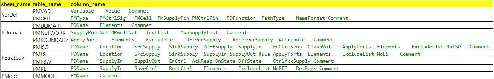
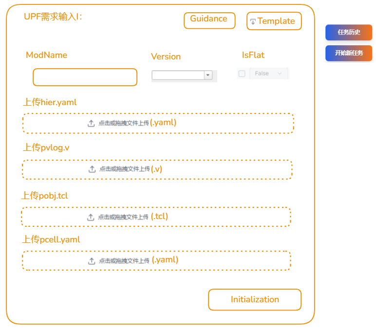
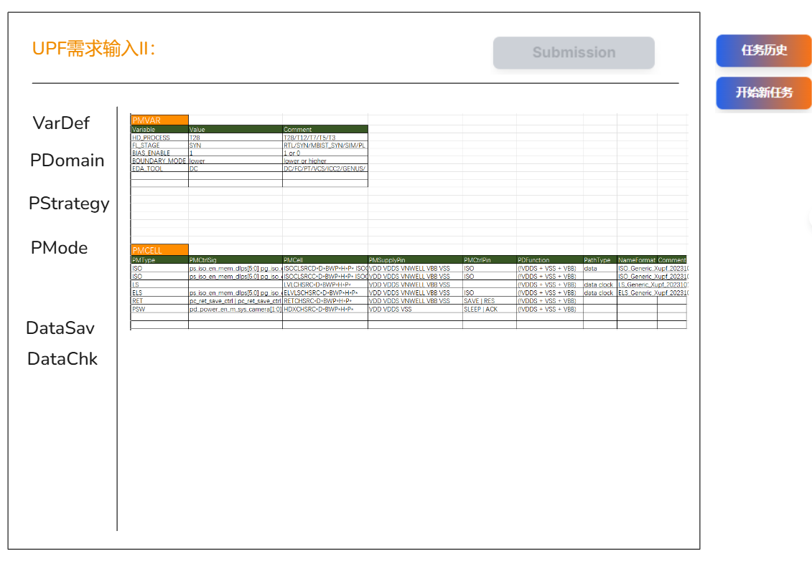

目前项目针对ECS only部署方式，已经开发并测试好如下几个工具服务，
1. 单页面交互的SDC工具；
2. 多页面交互的SDC工具；
3. 单页面交互的UPF工具；

接下来我们的任务是开发多页面交互的UPF工具在线服务系统，为了正确高效完整的完成开发任务，我们总体思路是围绕目前已经开发好的多任务交互的SDC工具的代码组织结构和功能逻辑进行对照，从SDC和UPF工具本身的业务逻辑、前端页面设计、数据库设计、API路由设计、worker执行系统，具体代码开发实现等方面展开论述，详细说明如下，
-  从业务本身角度出发，主要是在excel表格需求填写和工具脚本这两方面是最大的差别；
-  UPF工具的模板文件是项目根目录下templates/upfgen/pcont_org.xlsx，该模板分四个sheet，名称分别是VarDef，PDomain，PStrategy和PMode，每个sheet里有一张或者多张表格，每张表格都有相应的名称，这四个sheet名称和每个sheet里的所有表格名称都会作为网页端显示的名称和数据库模型设计的依据，确保excel表格与数据库之间，以及数据库与网页端表格之间，这两种数据交互方式的正确性和一致性，请记住这个要求，
	 sheet名称、table名称和column名称对应关系如下，其中column名称就是每个表格的列头名称，请正确识别下面表格的所有名称，并理解sheet、table和column之间的对应关系，
	
	 
-  使用 `exceljs` 库，解析UPF工具模板文件（项目根目录下templates/upfgen/pcont_org.xlsx）里的每个sheet里的表格，它不仅能读取单元格数据，还能完美地识别 Sheet 名称、Table 名称、Table 的列头，由此来设计元数据表来管理整个excel表格的数据，
    数据库模型设计完全可以参考多页面交互的SDC工具数据库模型设计，请务必正确识别并理解多页面交互的SDC工具数据库模型设计，并正确设计开发，下面是多页面交互的UPF工具数据库模型设计的说明和要求，
	数据库表参考如下：
		- `sheets` 表: `tool_type`, `sheet_id (PK)`, `sheet_name (UNIQUE)`, ..., `last_modified`
		- `tables` 表: `tool_type`, `table_id (PK)`, `sheet_id (FK)`, `table_name (UNIQUE within a sheet)`,  ..., `last_modified`
		- `table_data` 表: `user_id`，`tool_type`, `task_id`, `data_id (PK)`, `table_id (FK)`, `sheet_id (FK)`, `row_data (JSONB)`, `row_index`，`column_name` ， `data_type`，`last_modified`，...
			- `row_data` 字段可以直接存储一整行的数据，格式为 JSON 对象，使用 JSONB 类型（在 PostgreSQL 中）可以提高查询效率。
			- row_index字段表示每一行数据是有先后顺序的；
			- tool_type字段值必须是upfgen；
		必须注意`sheets` 表和`tables` 表跟工具类型和模板文件密切相关，`table_data` 表是跟user_id和task_id密切相关的；
		请完全参考多页面交互SDC工具的数据库初始化，不是简单的初始化，是按照实际业务要求和实际数据库设计来初始化，要求是在启动阶段自动完成，不要每次手动去处理；
		数据库交互包括excel表格与数据库之间，以及数据库与网页端表格之间，每次数据库数据的写入和读取都需要用户的权限和任务id等方面的授权和认证，确保有权限的用户能正确安全的操作对应工具任务的数据库数据；
	
	数据库大概有几个操作，
		- 解析模板excel文件templates/upfgen/pcont_org.xlsx，用来设计数据库并初始化数据库表格；
		- 在初始化页面点击initialization按钮后，同样会解析获取temp/<taskid>/pcont.xslx文件的表格数据，这里会有很多隐藏的下拉数据，同步更新数据库表格；
		- 在提交页面，点击sheet按钮，渲染表格，用户修改表格数据，点击DataSav按钮，会把网页端的所有表格数据同步更新到数据库；
		- 在提交页面，点击DataChk按钮，会将数据库数据同步到temp/<taskid>/pcont.xslx,同时，在temp/<taskid>目录下生成json格式文件（vardef.json, pdomain.json, pstrategy.json, pmode.json四个文件）；
		- 然后在提交页面根据用户是否有表格数据更新，来反复操作DataSav保存和DataChk检查，反复对数据库进行操作；
		- Excel ↔ 数据库，以及数据库 ↔ 网页端，这两种双方交互方式，必须是要在双方数据交互后，验证交互的双方各自表格数据是否一致的正确的相同的数据，必须包括对应表格结构验证检查，表格单元格数据值检查，还有单元格下拉数据的验证检查，务必理解这些关键点检查要求；
- 关于UPF工具的数据库模型设计，以及保存、交互同步、验证、查询，检索，增删等操作对应的代码逻辑，必须完全跟多页面交互的SDC工具保持一致相同，差别仅仅在于sheet名称表格名称列头名称和存储数据上的不同；
- 关于数据相关的所有同步更新后的验证检查要求如下，完全复用多页面交互的SDC工具相关的不同阶段数据操作后进行数据验证的代码逻辑，验证项目完全复用，务必理解并正确实现，
	严格的数据一致性验证：表结构，表数据，下拉数据，
	1. **Excel ↔ 数据库**：
	    - ✅ 初始化时：`parseTaskExcelFile` → `validateExcelDatabaseConsistency`
	    - ✅ DataChk时：用户修改后验证一致性
	2. **数据库 ↔ 网页端**：
	    - ✅ 数据加载时：从数据库到前端的数据传输验证
	    - ✅ 数据保存时：从前端到数据库的数据传输验证
	3. **用户操作 ↔ STATE**：
    - ✅ 下拉选择：更新STATE后验证
    - ✅ 输入操作：更新STATE后验证
- 关于API路由设计，保持跟多页面交互的SDC工具的路由设计完全一致，
  采用以下路由结构：
	/tools/upf-generator/initialize                    # 初始化页面
	/tools/upf-generator/task/:taskId                  # 任务主页面（默认显示VarDef sheet）
	/tools/upf-generator/task/:taskId/:sheetName       # 任务特定sheet页面
	/tools/upf-generator/task/:taskId/download         # 下载页面
- 前端页面设计，保持跟SDC工具三页面交互设计一致，分别是初始化页面、提交页面和下载页面，这三页面的样式布局完全遵循多页面交互的SDC工具里的三页面样式布局，与多页面交互的SDC工具的三页面交互相比较，说明如下，
	- 在初始化页面，要求如下，
		- 上传四个文件，分别是hier.yaml, pvlog.v, pobj.tcl 和 pcell.yaml，四个文件上传保存到项目根目录temp/{taskid}目录下面；
		- Guidance和Templates按钮直接复用单页面交互的UPF工具的对应两个按钮；
		- ModName输入框，Version和IsFlat这三个组件也直接复用单页面交互的UPF工具的对应组件；
		- 页面左侧需要增加任务历史和开始新任务的按钮，这两个组件相关代码完全复用多页面交互的SDC工具对应的两个按钮；
		- 页面布局如下，请务必正确识别并理解下面截图布局，并正确设计开发，
		 
		- Initialization按钮功能，请复用多页面交互SDC工具的 Initialization按钮的代码逻辑，但是模板文件改为项目根目录下templates/upfgen/pcont_org.xlsx，
			- 要求完成如下步骤，
				a2. ✅ **权限验证** ，必须是注册并登录用户，没有登录跳转到登录页面；
				a3. ✅ **检查Redis队列上限** ，超过设定的队列上限，就提示“由于目前任务比较多，请稍后再使用”；
				a4. ✅ **建立任务ID数据库数据**  
				a5. ✅ **在项目根目录下建立temp/{taskId}和logs/{taskId}目录**  
				a6. ✅ **保存上传数据到temp/{taskId}目录** 
			- 调用项目根目录下app/backend/src/tools/upf_dg_gen.py脚本来生成temp/{taskId}/pcont.xlsx文件，脚本命令如下，
				 python upf_dg_gen.py upf_dg_gen -taskid {taskid} -dg
				 上面脚本需要传入任务ID参数，以及ECS_TEMPLATES_DIR，TEMP_UPLOAD_DIR和TASK_LOGS_DIR三个环境变量（后端.env里有设置）；
			- 根据生成好pcont.xlsx文件里的不同sheet里的表格内容，来更新数据库对应sheet里对应表格数据，注意dcont.xlsx文件表格单元cell里会有很多下拉数据；
			- 根据上面更新好的数据库表格数据，用户只需要点击提交页面里的左侧相应sheet名称，就可以更新渲染网页端对应sheet里所有表格的数据；
	- 点击初始化按钮后，跳转到提交页面，这个页面所有按钮的相关代码逻辑完全复用多页面交互的SDC工具的提交页面里的对应按钮的相关代码逻辑，说明如下，
		- 主要差别在左侧sheet按钮名称不同，以及每个sheet点击后呈现的表格名称结构以及数据不同而已，请务必理解这个关键差别；
		- 页面布局如下，请务必正确识别并理解下面截图布局，并正确设计开发，
			
		- 这里特别强调所有表格的excel-like的编辑功能，也是完全复用多页面交互的SDC工具的页面表格的编辑功能，所以务必找到相关代码直接复用；
		- DataSav按钮，DataChk按钮和Submission按钮，这三个按钮对应的代码逻辑和按钮样式完全复用多页面交互的SDC工具的提交页面里对应按钮；
		- 关于DataChk按钮，会调用项目根目录下app/backend/src/tools/upf_dg_chk.py，脚本命令如下，
			  python upf_dg_chk.py upf_dg_chk -taskid {taskid} -chk  
			 上面脚本需要传入任务ID参数，以及TEMP_UPLOAD_DIR和TASK_LOGS_DIR二个环境变量（后端.env里有设置）；
		- 页面左侧同样是任务历史和开始新任务按钮，完全复用多页面交互的SDC工具的任务历史和开始新任务按钮；
		- 点击提交按钮后，进入下载页面，worker系统开始完成下面的任务执行流程，完全跟多页面交互的SDC工具保持相同一致，直接复用，
			a7. ✅ **任务入队**  
			a8. ✅ **Worker获取任务ID**  
			a9. ✅ **工具容器加载**  
			a10. ✅ **创建jobs/{taskId}目录和子目录，复制按文件类型来复制**，
			- json文件复制到jobs/{taskId}/work/{modName}/upfgen/json目录下面；
			- 除了json文件，temp/{taskid}下面的四个上传文件，都复制到上传数据到jobs/{taskId}/input和jobs/{taskId}/work/{modName}/upfgen/inputs；
			a11. ✅ **容器启动执行工具命令**  
			a12. ✅ **生成结果并打包到jobs/{taskId}/output**  
			a13. ✅ **立即清理jobs/{taskId}/work目录**  
			a14. ✅ **2分钟下载期后清理temp/{taskId}目录和jobs/{taskId}**
			a15. ✅ 清理该任务相关的数据库`table_data`表格里的数据，保留`sheets` 表模型和`tables` 表模型；
		上面a15是因为任务相关的数据都必须清理掉，确保用户数据安全；
	- 进入下载页面，该页面的布局样式设计和对应的下载按钮的代码逻辑，任务历史和开始新任务按钮的代码逻辑，也是完全复用多页面交互的SDC工具的下载页面对应的代码逻辑，要求直接拷贝多页面交互的SDC工具的下载页面相关的代码文件，将文件名里的sdc替换为upf就可以，确保完全复用多页面交互的SDC工具下载页面；
- worker执行系统和状态管理也是完全复用多页面交互的SDC工具worker执行系统和状态管理；
- 从上面梳理的要求来看，页面设计、数据库设计，数据交互，API路由，worker系统等方面，基本都是复用多页面交互的SDC工具，所以为了高效正确的实现代码开发，由于多页面SDC工具新增代码文件名都是有_thrpages关键字（同样，多页面UPF工具新增代码文件名也必须要有_thrpages关键字），所以可以直接拷贝多页面交互的SDC工具的相关代码文件，在目前代码库里搜索所有包含_thrpages关键字代码文件都在相应目录拷贝一份，然后把代码文件名里的sdc改为upf，比如文件sdc_thrpages.routes.ts在相应目录下面拷贝成upf_thrpages.routes.ts文件，然后结合上面的实际需求和应用场景要求上的差别，全面仔细的审查拷贝后的代码文件，并精准修复upf_thrpages.routes.ts文件代码，或者是完全复用不变，请务必理解这个要求；
- 在复用时，注意利用任务数据库里的tool_type和多页面交互的控制字段来处理相关代码逻辑，确保代码改动精准并最小化；
        tool_type = task.parameters.get('toolType', 'upfgen')
        is_multi_page = task.parameters.get('isMultiPage', False) or task.parameters.get('pageMethod') == 'multi'
- 在开发多页面交互的UPF工具过程中，绝不能修改已经开发好的下面三个场景的工具服务相关所有代码结构和代码逻辑，确保已有业务功能的正常工作，
	1. 单页面交互的SDC工具；
	2. 多页面交互的SDC工具；
	3. 单页面交互的UPF工具。
	 

请仔细系统的理解上面的要求和说明，尤其是代码复用的思想和带有*_thrpages*关键字的代码文件拷贝再修改的开发思路，并仔细系统深入的审查和理解目前已经开发好的多页面交互的SDC工具、单页面交互的SDC工具和单页面交互的UPF工具所有相关代码逻辑，特别是多页面交互的SDC工具的带有*_thrpages*关键字的代码逻辑(可以采用直接拷贝并替换文件名里的sdc为upf作为新增的upf多页面工具的基础代码文件)，然后深入理解代码文件和前面文档里的相关要求来精准有效的完成多页面交互的UPF工具开发，

根据上面多页面间交互的UPF工具开发的要求和说明，规划和制定正确合理的开发计划，并有节奏地分阶段完成多页面交互的UPF工具开发，确保上面提出多页面交互的UPF工具的所有要求和功能都能正确有效的完成， 

必须在开发每个功能和任务之前，仔细系统的审查并理解目前已经开发好的相关前后端代码逻辑，既不要重复开发冗余代码，也不要盲目的想当然的胡乱去修改已经开发好的代码逻辑，

